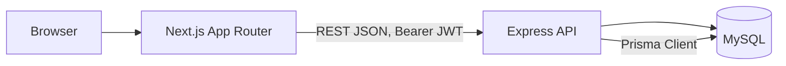

# Dhaka Tesla Pool — Master Implementation Plan

> Purpose: this is the build blueprint for the RoBenDevs "Dhaka Tesla Pool" ride-pooling MVP
> assessment. Follow it top to bottom, phase by phase. Each phase = one or more git feature
> branches. Do not skip Phase 0 (design docs) — the brief explicitly grades "architecture first".
>
> **Rev 2 note:** this revision corrects the pool/ride relationship model, separates pool
> matching from driver acceptance, fixes fare arithmetic to integer-only, and makes the
> concurrency plan Prisma-specific. See Section 12 for the full assumptions log.

---

## 0. Non-negotiables (re-read before every phase)

- Stack: **Node.js (Express) backend, Next.js (App Router) frontend, MySQL, Prisma ORM**
- Money stored as **integer paisa**, never float/decimal — no `*0.15`, use `floor(x * 15 / 100)`
- Story cast only: **Jashim (driver), Bullet (Tesla, capacity 3), Nusrat, Rafiq, Shirin (passengers)** — never `user1`/`driver1`
- **`RideRequest.status`** (passenger journey) and **`Pool.status`** (Tesla's shared trip) are separate state machines — never conflated
- Passenger lifecycle: `REQUESTED → MATCHED → DRIVER_ARRIVED → STARTED → COMPLETED` (+ `CANCELLED` from `REQUESTED`/`MATCHED` only)
- Pool lifecycle: `OPEN → MATCHED → DRIVER_ARRIVED → STARTED → COMPLETED` (+ `CANCELLED` from `OPEN`/`MATCHED`)
- A ride request being grouped into a pool is **not** the same event as the passenger being matched — matching happens only when a driver accepts the pool (Section 3.1)
- `pool_memberships` is the **only** relationship between `pools` and `ride_requests` — no redundant FK on `ride_requests`
- Branch model: `master`, `pre-release`, `release/v1.0.0`, `feature/*`, merged with `--no-ff`
- Commit format: `type(scope): short description` — never "update"/"fix"/"final"
- No microservices/Kafka/Redis/queues unless justified in the bonus scaling section only
- Docker Compose must bring up everything with one command

---

## 1. Tech Stack & Justification (put this almost verbatim in README §7)

| Layer | Choice | Why | Alternative considered | Would switch if... |
|---|---|---|---|---|
| Backend | Express | Minimal boilerplate, fast to reason about for a small MVP, team already fluent in it | NestJS (more structure but steeper setup cost for this scope) | Team/codebase grows past ~15 endpoints and needs enforced module boundaries |
| DB | MySQL (InnoDB) | Relational integrity + real FK constraints; InnoDB gives transactions and row-level locking (`SELECT ... FOR UPDATE`) needed for seat-capacity concurrency; widest free-tier hosting availability (PlanetScale, Railway, Aiven) | PostgreSQL (slightly stronger isolation defaults, native JSON/array types), SQLite (no real concurrency story) | Need heavy geospatial queries at scale, or stricter isolation guarantees → PostgreSQL + PostGIS |
| ORM | Prisma | Schema-first, migrations built-in, type-safe queries, works identically across MySQL/Postgres, fast to demo/explain | Knex (more manual), TypeORM (heavier) | N/A for this scope |
| Auth | JWT + bcrypt | Stateless, simple to reason about for an MVP with two roles | Session-based auth (needs sticky store) | Multi-device session revocation becomes a real requirement |
| Validation | Zod | Type inference + runtime validation in one place | Joi | N/A |
| Frontend | Next.js App Router | File-based routing, recommended by brief | Plain React + React Router | N/A |
| Styling | Tailwind CSS | Fast, matches your existing experience | CSS Modules | N/A |
| Tests | Jest + Supertest (backend), Vitest/RTL (frontend, optional) | Standard, fast to set up | Mocha/Chai | N/A |
| Hosting | Frontend: Vercel. Backend + DB: whichever free-tier MySQL-compatible host is actually available at deploy time (e.g. Railway, PlanetScale, Aiven) | Free, supports Docker + MySQL | Render (backend only; its free managed DB is Postgres-only) | See Section 10, "Deployment" — availability must be re-verified before deploying, never assumed |

### 1.1 Authentication Details

- **JWT payload (minimal, no PII beyond what's needed for authorization):**
  ```json
  { "sub": "user-id", "role": "PASSENGER" }
  ```
  Do not put email, name, or anything sensitive in the token — it's not encrypted, only signed.
- **Token storage/transport (MVP assumption — label this in `docs/decisions.md`):** the frontend
  (Next.js) and backend (Express) are two separate services, so a cross-origin `httpOnly` cookie
  setup adds real complexity (SameSite/CORS credentials configuration) for a 2-week MVP. This plan
  uses **`Authorization: Bearer <token>`**, with the token held in a React context/provider on the
  client and persisted to `localStorage` so a page refresh doesn't force re-login.
  - **Trade-off, state this honestly in README:** `localStorage` tokens are readable by any script
    on the page (XSS risk) whereas `httpOnly` cookies are not. This is an accepted MVP trade-off.
  - **Do not claim SSR authentication.** Because the token lives in `localStorage` (client-only,
    not sent automatically with the initial HTML request), Next.js server components cannot read
    it. Any page that needs auth-aware data renders as a **client component** (`"use client"`)
    and fetches after mount. If true SSR-authenticated pages are needed later, that requires
    moving to `httpOnly` cookies with a same-site proxy — documented as a known limitation, not
    implemented in this MVP.

---

## 2. Architecture (Phase 0 deliverable — commit to `docs/architecture.md` on `master` early)



Layers:
- **Presentation:** Next.js — passenger flow, driver flow, shared components
- **API:** Express — route handlers → controllers → services → Prisma repository calls
- **Business logic location:** service layer only (never in route handlers, never in Prisma calls directly) — this is a scored item ("business-logic placement")
- **Persistence:** MySQL via Prisma, migrations checked into repo

---

## 3. Database Schema (ERD) — commit to `docs/erd.md`

```mermaid
erDiagram
    USERS ||--o{ TESLAS : owns
    USERS ||--o{ RIDE_REQUESTS : requests
    TESLAS ||--o{ POOLS : serves
    POOLS ||--o{ POOL_MEMBERSHIPS : contains
    RIDE_REQUESTS ||--o| POOL_MEMBERSHIPS : "belongs to"
    RIDE_REQUESTS ||--o{ RIDE_STATUS_HISTORY : logs
    ZONES ||--o{ RIDE_REQUESTS : "pickup/destination"

    USERS {
        uuid id PK
        string name
        string email UK
        string password_hash
        enum role "passenger|driver"
        string phone
        datetime created_at
    }
    TESLAS {
        uuid id PK
        uuid driver_id FK, UK "one Tesla per driver — MVP assumption"
        string name
        int capacity
        enum status "online|offline"
        datetime created_at
    }
    ZONES {
        uuid id PK
        string name UK
        string cluster
    }
    RIDE_REQUESTS {
        uuid id PK
        uuid passenger_id FK
        uuid pickup_zone_id FK
        uuid destination_zone_id FK
        int seats_requested
        enum status "REQUESTED|MATCHED|DRIVER_ARRIVED|STARTED|COMPLETED|CANCELLED"
        int estimated_fare_paisa "set at creation, no pool discount"
        int fare_paisa "nullable; finalized when the pool is MATCHED"
        datetime requested_at
        datetime matched_at
        datetime arrived_at
        datetime started_at
        datetime completed_at
        datetime cancelled_at
    }
    POOLS {
        uuid id PK
        uuid tesla_id FK
        enum status "OPEN|MATCHED|DRIVER_ARRIVED|STARTED|COMPLETED|CANCELLED"
        int seats_occupied "aggregate counter — see 3.2"
        datetime created_at
        datetime matched_at
        datetime completed_at
    }
    POOL_MEMBERSHIPS {
        uuid id PK
        uuid pool_id FK
        uuid ride_request_id FK UK "one ride request cannot join two pools"
        int seats "per-passenger allocation — see 3.2"
        datetime created_at
    }
    RIDE_STATUS_HISTORY {
        uuid id PK
        uuid ride_request_id FK
        string from_status
        string to_status
        datetime changed_at
        uuid changed_by FK
    }
```

**Key constraints (implement at DB level, not just app level):**
- `ride_requests` has **no `pool_id` column.** `pool_memberships` is the sole join table between
  `pools` and `ride_requests` — this removes the redundant/duplicate relationship that existed in
  Rev 1. To find a ride request's pool: `pool_memberships.where(ride_request_id = ...)`.
- `pool_memberships.ride_request_id` is **UNIQUE** — enforces that one ride request can never be a
  member of two pools simultaneously (this is now the *only* place that invariant is enforced).
- `teslas.driver_id` is **UNIQUE** — MVP assumes one Tesla per driver (documented assumption,
  Section 12). Driver authorization checks must verify both role AND ownership (Section 7.1).
- `teslas.capacity` = fixed int (e.g. 3), CHECK `capacity > 0` (MySQL 8.0.16+ enforces CHECK
  constraints; confirm your target MySQL version supports it, older versions silently ignore them)
- `pools.seats_occupied` must never exceed `teslas.capacity` — enforced primarily via transaction +
  row lock (Section 6); a CHECK constraint is a second line of defense only, don't rely on it alone
  since app-level enforcement is what's actually being graded
- FK indexes on all FK columns (`driver_id`, `pickup_zone_id`, `pool_id`, `ride_request_id`, etc.)
- `zones.cluster` — predefined grouping used for matching rule (Section 4)

### 3.1 Domain Model: Matching vs. Driver Acceptance (corrects Rev 1's conflation)

These are **two distinct events**, and the brief explicitly requires they not be conflated:

```
REQUESTED
   ↓
compatible OPEN pool found (or a new OPEN pool created)
   → a pool_membership row is inserted; ride_request.status stays REQUESTED
   ↓
pool becomes visible to the owning driver (GET /api/driver/requests)
   ↓
driver explicitly accepts the pool  (POST /api/driver/pools/:poolId/accept)
   ↓
pool.status: OPEN → MATCHED
   → cascades: every current member's ride_request.status REQUESTED → MATCHED
   → cascades: fare_paisa finalized for every member (Section 5.2)
   → no further ride_requests may join this pool after this point
```

**Why this separation matters:** grouping requests into a pool is a system-side optimization step
(finding who *could* share a ride); acceptance is the driver's business decision to actually take
that trip. Treating pool assignment as "matched" would let a passenger see `MATCHED` status before
any driver has actually committed to picking them up — misleading and wrong per the brief's own
lifecycle table.

### 3.2 Domain Model: Pool State vs. Ride Request State

- **`RideRequest.status`** represents one passenger's individual journey — what *they* see.
- **`Pool.status`** represents the Tesla's shared trip container — what the *driver* sees and
  drives through the stages.
- Pool lifecycle: `OPEN → MATCHED → DRIVER_ARRIVED → STARTED → COMPLETED` (+`CANCELLED` from
  `OPEN`/`MATCHED`).
  - `OPEN`: accepting compatible ride requests, not yet accepted by a driver.
  - `MATCHED`: a driver has accepted; membership is locked, no further joins.
  - `DRIVER_ARRIVED` / `STARTED` / `COMPLETED`: trip stages, driver-driven, cascade to all member
    ride_requests (Section 7).
  - `CANCELLED`: pool cancelled (e.g. it becomes empty after the last member cancels).
- **Deliberately no separate `FULL` status** (unlike the brief's example enum). "Full" is a
  *computed* condition — `pool.seats_occupied >= tesla.capacity` — checked by the matching service
  when deciding whether an `OPEN` pool can accept one more request. Persisting it as its own status
  would be a duplicated state with no additional transition behavior attached to it, which Section
  16 of the brief specifically warns against. This is documented as an MVP assumption (Section 12).
- When a pool transitions `DRIVER_ARRIVED`/`STARTED`/`COMPLETED`, every member ride_request with an
  active (non-cancelled) status moves in lockstep, and one `ride_status_history` row is written per
  affected ride_request (Section 7).

### 3.3 `seats_occupied` vs. `pool_memberships.seats`

- `pool_memberships.seats` = the seat count allocated to **one specific passenger's** membership row.
- `pools.seats_occupied` = a **maintained aggregate counter** on the pool, equal to the sum of all
  its active memberships' `seats`. It exists purely so a capacity check is a single indexed row
  read (`SELECT seats_occupied FROM pools WHERE id = ? FOR UPDATE`) instead of a `SUM()` aggregate
  query on every seat-claim attempt — this matters under the concurrency scenario in Section 6.
- **This is intentional, acceptable duplication for the MVP**, not a normalization mistake — but it
  only stays correct if every write that touches membership seats also updates the counter **in the
  same database transaction**. There is exactly one code path allowed to mutate `seats_occupied`:
  the pool-membership service, and it always does so inside the transaction described in Section 6.
  Document this rule explicitly in README's "Key Decisions" section.

---

## 4. Predefined Zones & Matching Rule (document in README §4)

Seed zones (flat list, no real geo): Banani, Gulshan, Mohakhali, Dhanmondi, Mirpur, Uttara, Farmgate, Bashundhara.

**Matching rule (deterministic, testable, no map API):** two ride requests are pool-compatible
if **all** of the following hold:

1. `pickup_zone.cluster` is identical for both requests
2. `destination_zone.cluster` is identical for both requests
3. `existing_pool.seats_occupied + new_request.seats_requested <= tesla.capacity`

Each `zone` row carries a single `cluster` label, and the rule is applied independently to the
pickup zone and the destination zone of each request — it does not require the pickup and
destination to share a cluster with *each other*, only that both requests agree pairwise on each
leg. This keeps the rule a plain equality check on two columns, fully unit-testable without any
distance math.

**Example cluster:** `"Gulshan-Mohakhali corridor"` contains Gulshan, Mohakhali, Banani.

**Why Nusrat and Rafiq match:** Nusrat is Banani → Mohakhali, Rafiq is Banani → Gulshan 1.
- Pickup: both `Banani` → same pickup zone → trivially same cluster. ✅
- Destination: `Mohakhali` and `Gulshan 1` are both members of the `"Gulshan-Mohakhali corridor"`
  cluster → same destination cluster. ✅
- Seats: both request 1 seat, Bullet has capacity 3, 0 currently occupied → 2 ≤ 3. ✅

All three conditions hold, so the matching service places them in the same `OPEN` pool.

---

## 5. Fare Model (integer arithmetic only — must be hand-calculable)

```
distanceChargePaisa = distanceKm(pickup_zone, destination_zone) * ratePerKmPaisa
poolDiscountPaisa    = floor(baseFarePaisa * 15 / 100)        // NOT baseFare * 0.15
```

- `baseFarePaisa` = 3000 (৳30)
- `ratePerKmPaisa` = 1500 (৳15/km)
- Zone-to-zone distance: hardcoded lookup table (no map API) — seed a small `zone_distance` table
  or a JS constant map, values in whole km (integers)
- **All monetary math uses integer paisa and integer/floor division — never a float literal like
  `0.15` in the codebase.** Use `Math.floor(baseFarePaisa * 15 / 100)` (Node integers up to this
  size are exact; for larger amounts use `BigInt` if you want to be extra safe, not required at MVP
  fare sizes).

### 5.1 Estimated Fare vs. Final Pooled Fare (corrects Rev 1's ambiguity)

- **`estimated_fare_paisa`** — computed and stored **at ride-request creation** (`POST /api/rides`),
  **without** `poolDiscountPaisa` applied. This is what the passenger sees immediately: "your
  estimated fare is ৳XX.XX, may be lower if pooled."
- **`fare_paisa`** — starts `NULL`. It is computed and written **once**, at the moment the pool
  transitions `OPEN → MATCHED` (driver accepts, Section 3.1), using the final membership count at
  that instant:
  - If the pool has **2 or more** active members at acceptance time → each member's `fare_paisa` =
    `baseFarePaisa + distanceChargePaisa - poolDiscountPaisa` for *their own* distance.
  - If the pool has exactly **1** member at acceptance time (no one ever pooled with them) →
    `fare_paisa` = `estimated_fare_paisa` (no discount).
  - **MVP assumption, documented in Section 12:** fare is finalized once, at `MATCHED`, not
    recalculated on every membership join beforehand. This keeps the calculation a single,
    testable step instead of a running recomputation.

### 5.2 Worked Example (must match test assertions exactly)

Nusrat (Banani→Mohakhali, 3km) & Rafiq (Banani→Gulshan1, 4km), pooled together, pool reaches
`MATCHED` with both as members:

```
poolDiscountPaisa = floor(3000 * 15 / 100) = floor(450) = 450

Nusrat: 3000 + (3 * 1500) - 450 = 3000 + 4500 - 450 = 7050 paisa = ৳70.50
Rafiq:  3000 + (4 * 1500) - 450 = 3000 + 6000 - 450 = 8550 paisa = ৳85.50
```

These numbers are unchanged from Rev 1 — only the arithmetic path (floor/integer instead of a
float literal) and the *timing* of when they're written (`fare_paisa` at `MATCHED`, not at request
creation) changed.

---

## 6. Concurrency Handling (Prisma-specific — Section 14 of the brief, be ready to defend in interview)

**Scenario:** Bullet has 1 seat left. Nusrat and Shirin both hit "claim seat" near-simultaneously.

**MVP solution, Prisma-specific:**

```
prisma.$transaction(async (tx) => {
  // Prisma's high-level API has no built-in FOR UPDATE — raw SQL is required for MySQL row locks.
  const [pool] = await tx.$queryRaw`
    SELECT id, seats_occupied FROM pools WHERE id = ${poolId} FOR UPDATE
  `;

  const tesla = await tx.tesla.findUnique({ where: { id: pool.teslaId } });

  if (pool.seats_occupied + requestedSeats > tesla.capacity) {
    throw new SeatsUnavailableError(); // transaction rolls back, caller returns 409
  }

  await tx.poolMembership.create({
    data: { poolId, rideRequestId, seats: requestedSeats },
  });

  await tx.$executeRaw`
    UPDATE pools SET seats_occupied = seats_occupied + ${requestedSeats} WHERE id = ${poolId}
  `;
});
```

- **The row lock must be acquired and held for the lifetime of this transaction.** `SELECT ... FOR
  UPDATE` only takes effect inside an explicit transaction — `prisma.$transaction(...)` (interactive
  transaction callback) provides that boundary; a bare `prisma.pool.findUnique()` outside a
  transaction does **not** lock anything, even if you intended it to.
- Because Prisma's query builder does not expose `FOR UPDATE` directly, `tx.$queryRaw` is required
  for the locking read, and `tx.$executeRaw` (or a normal `tx.pool.update`) for the counter
  increment — **document this explicitly in README**, it's a real Prisma/MySQL limitation, not an
  oversight.
- This serializes both requests at the DB row level — the second request's `SELECT ... FOR UPDATE`
  blocks until the first transaction commits or rolls back, then re-reads the updated
  `seats_occupied` and correctly fails.

**Document in README:** "At MVP scale, a MySQL (InnoDB) row lock inside a Prisma interactive
transaction is sufficient and simple to reason about — InnoDB's default `REPEATABLE READ` isolation
combined with `FOR UPDATE` prevents the double-claim. At larger scale (Section 10 bonus) this would
move to a Redis-backed distributed lock or a single-writer queue per Tesla to avoid DB contention
under high concurrency."

### 6.1 Cancellation & Seat Release (new — corrects Rev 1's missing spec)

`POST /api/rides/:id/cancel`, passenger-owned, allowed **only** from `REQUESTED` or `MATCHED`
(explicitly rejected — 409 — from `DRIVER_ARRIVED`, `STARTED`, `COMPLETED`). All of the following
happen **atomically in one Prisma transaction**:

1. Re-check current `ride_request.status` inside the transaction (avoid a stale-read race with a
   driver simultaneously advancing the pool).
2. Set `ride_request.status = CANCELLED`, `cancelled_at = now()`.
3. If a `pool_membership` row exists for this ride request: delete it, and decrement the parent
   pool's `seats_occupied` by that membership's `seats` — same transaction, same row-lock pattern as
   Section 6 (`SELECT ... FOR UPDATE` on the pool row before decrementing).
4. If, after removal, the pool has **zero** active memberships:
   - if `pool.status` was `OPEN` → set `pool.status = CANCELLED`
   - if `pool.status` was `MATCHED` (driver already accepted, then the only/last passenger
     cancelled) → also set `pool.status = CANCELLED` (nothing left for the driver to drive)
5. Write a `ride_status_history` row for the cancellation.
6. **Known MVP limitation, document in README:** if a passenger cancels *after* `MATCHED` while
   other members remain, their `fare_paisa` is **not** retroactively recalculated for the
   remaining passengers (fare was finalized once, per Section 5.1). Flag this as a "next
   improvement," not a silent bug.

**Required tests:** cancel from `REQUESTED` succeeds and releases no membership (none existed
yet, or one existed pre-match); cancel from `MATCHED` releases membership and decrements
`seats_occupied`; cancel from `DRIVER_ARRIVED`/`STARTED`/`COMPLETED` is rejected with 409; cancelling
the last member of a pool cancels the pool too.

---

## 7. API Endpoint Contract

### 7.1 Authentication & Authorization (applies to every row below)

- Every non-public route requires `Authorization: Bearer <jwt>`; payload shape in Section 1.1.
- **Passenger-owned resources:** a passenger may only read/act on `ride_requests` where
  `passenger_id = req.user.sub`. Enforced in the service layer, tested explicitly (Section 9).
- **Driver-owned resources:** a driver may only read/act on `teslas`/`pools` where
  `teslas.driver_id = req.user.sub`. A driver must never modify another driver's Tesla or pool —
  since `teslas.driver_id` is UNIQUE, this check is a single equality comparison, not a search.

| Method | Path | Role | Purpose |
|---|---|---|---|
| POST | `/api/auth/signup` | public | create passenger or driver |
| POST | `/api/auth/login` | public | returns JWT |
| POST | `/api/teslas` | driver | register Bullet (name, capacity) — rejected if driver already owns one (UNIQUE) |
| PATCH | `/api/teslas/:id/status` | driver (own) | online/offline |
| POST | `/api/rides` | passenger | request ride (pickup, destination, seats) → creates `REQUESTED` ride_request, computes `estimated_fare_paisa`, runs matching service (Section 3.1/4) |
| GET | `/api/rides/:id` | passenger (own) | status + estimated/final fare |
| GET | `/api/rides` | passenger | own ride history |
| POST | `/api/rides/:id/cancel` | passenger (own) | only valid from `REQUESTED`/`MATCHED` — see Section 6.1 |
| GET | `/api/driver/requests` | driver | `OPEN` pools/requests visible/matchable to their online Tesla |
| POST | `/api/driver/pools/:poolId/accept` | driver (own) | `OPEN → MATCHED` — cascades ride_request status + finalizes fares (Section 3.1, 5.1) |
| PATCH | `/api/driver/pools/:poolId/status` | driver (own) | body `{ status: DRIVER_ARRIVED \| STARTED \| COMPLETED }` — pool-level, cascades to every active member ride_request + writes history rows (Section 3.2) |
| GET | `/api/driver/pools/:id` | driver (own) | passengers + seats + status for one pool |
| GET | `/api/driver/history` | driver | pools/trips (any terminal or in-progress) tied to the authenticated driver's Tesla |

**Why trip-stage transitions moved from `PATCH /api/rides/:id/status` (Rev 1) to
`PATCH /api/driver/pools/:poolId/status` (Rev 2):** `DRIVER_ARRIVED`/`STARTED`/`COMPLETED` are
physically true for the whole Tesla at once — the driver doesn't arrive separately for each
passenger. Modeling it as a per-ride endpoint would let inconsistent states creep in (one
passenger `STARTED`, another still `MATCHED`, same physical car). The pool-level endpoint is the
single source of truth for trip-stage changes; it fans out to member `ride_requests` and writes one
`ride_status_history` row per affected passenger inside the same transaction.

---

## 8. Phase-by-Phase Build Order (each = feature branch, merge to `master` with `--no-ff`)

### Phase 0 — `docs/` (commit directly to master, small doc-only commits)
- [ ] `docs/architecture.md` with the mermaid diagram (Section 2)
- [ ] `docs/erd.md` with the mermaid ERD (Section 3) plus the 3.1/3.2/3.3 domain-model notes
- [ ] `docs/fare-model.md` with the worked example (Section 5.2)
- [ ] `docs/decisions.md` — seed it with the assumptions in Section 12, keep appending as you build

### Phase 1 — `feature/project-scaffold`
- [ ] Monorepo or two-folder structure: `/backend`, `/frontend`
- [ ] Express app skeleton, health check route `GET /health`
- [ ] Prisma init (`provider = "mysql"`), `.env.example`, docker-compose skeleton (app + mysql only, no migrations yet)
- [ ] Commit: `build(scaffold): initial backend/frontend structure`

### Phase 2 — `feature/passenger-auth` + `feature/driver-tesla-setup`
- [ ] `users` table, signup/login endpoints, JWT middleware (payload per Section 1.1)
- [ ] `teslas` table with `driver_id UNIQUE`, driver Tesla creation + online/offline toggle
- [ ] Reject a second Tesla for a driver who already owns one — test this explicitly
- [ ] Seed script: Jashim, Bullet(capacity 3), Nusrat, Rafiq, Shirin
- [ ] Zod validation on both endpoints
- [ ] Tests: signup validation, login success/failure, JWT required on protected routes, Tesla-ownership uniqueness

### Phase 3 — `feature/ride-request`
- [ ] `zones` table + seed (Banani, Gulshan, Mohakhali, Dhanmondi, Mirpur, Uttara, Farmgate, Bashundhara) with `cluster` field
- [ ] `ride_requests` table (no `pool_id` column — Section 3)
- [ ] `POST /api/rides` — validates zones, computes `estimated_fare_paisa` (no discount, Section 5.1), status = `REQUESTED`
- [ ] Tests: `estimated_fare_paisa` unit test against the base numbers (no discount), floor/integer math verified (no floating-point assertions)

### Phase 4 — `feature/tesla-pooling`
- [ ] `pools`, `pool_memberships` tables (`pool_memberships.ride_request_id UNIQUE`)
- [ ] Matching service (Section 4): given a new `ride_request`, find a compatible `OPEN` pool
      (same pickup cluster, same destination cluster, capacity available) or create a new `OPEN`
      pool. Inserts a `pool_membership` row; **ride_request.status stays REQUESTED** (Section 3.1)
- [ ] `GET /api/driver/requests` — lists `OPEN` pools visible to the driver's online Tesla
- [ ] `POST /api/driver/pools/:poolId/accept` — `OPEN → MATCHED`, cascades ride_request status,
      finalizes `fare_paisa` for all current members (Section 5.1)
- [ ] Tests: Nusrat+Rafiq end up in the same `OPEN` pool and stay `REQUESTED` until accepted; a
      non-matching request (e.g. to Mirpur) does not join; after `accept`, both flip to `MATCHED`
      and get the exact fares from Section 5.2

### Phase 5 — `feature/capacity-enforcement`
- [ ] Wrap seat-claim in a Prisma interactive transaction using `$queryRaw`/`$executeRaw` for the
      `FOR UPDATE` lock (Section 6) — not a plain Prisma query, that would not lock
- [ ] Return 409 on overbooking attempt
- [ ] **Concurrency test:** simulate Nusrat + Shirin racing for the last seat (e.g. `Promise.all` of
      two claim calls in the test), assert exactly one succeeds and `seats_occupied` never exceeds
      `capacity`

### Phase 6 — `feature/ride-lifecycle`
- [ ] State machine guards for both `RideRequest.status` and `Pool.status` (Section 3.2) — reject
      invalid transitions on either
- [ ] `PATCH /api/driver/pools/:poolId/status` (Section 7) — cascades `DRIVER_ARRIVED`/`STARTED`/
      `COMPLETED` to every active member ride_request, writes one `ride_status_history` row per
      affected passenger, same transaction
- [ ] `POST /api/rides/:id/cancel` — full atomic flow from Section 6.1 (release membership,
      decrement `seats_occupied`, cancel empty pool, reject from terminal/in-progress states)
- [ ] Tests: full valid lifecycle passes for a pooled pair, each invalid jump rejected on both
      state machines, cross-user access rejected (403), all Section 6.1 cancellation cases

### Phase 7 — `feature/frontend-passenger-flow`
- [ ] Signup/login pages (JWT stored per Section 1.1, explicit `"use client"` on auth-aware pages)
- [ ] Request-ride form (pickup, destination dropdowns from zones, seats) — shows
      `estimated_fare_paisa` immediately
- [ ] Status tracking page (poll or refetch) — shows `fare_paisa` once it's finalized (post-MATCHED)
- [ ] Ride history list
- [ ] Loading/error/empty states for every screen (explicitly scored)

### Phase 8 — `feature/frontend-driver-flow`
- [ ] Online/offline toggle
- [ ] Pending pool/request list (`GET /api/driver/requests`)
- [ ] Accept pool → passenger/seat view → arrived/start/complete buttons (calling the pool-level
      status endpoint, not a per-ride one)
- [ ] `GET /api/driver/history` view

### Phase 9 — `feature/docker-deploy`
- [ ] Full `docker-compose.yml`: backend, frontend (optional container), mysql:8, healthchecks
      (`mysqladmin ping` for the DB service)
- [ ] Migrations run automatically on `docker compose up` (entrypoint script or `prisma migrate deploy`)
- [ ] Seed data loads automatically in dev mode
- [ ] `.env.example` complete, no real secrets anywhere in repo

### Phase 10 — `pre-release`
- [ ] Cut `pre-release` from `master` (`--no-ff`)
- [ ] Integration bug fixes and documentation/deployment prep only, no new features
- [ ] **Immediately before deploying**, verify which free-tier MySQL host is actually available
      right now (do not rely on Section 1's hosting row as a permanent fact — re-check); deploy
      frontend to Vercel, backend+DB to whichever host checks out, or document the constraint and
      fall back to the Docker instructions as the reproducible deployment path
- [ ] Full README pass (see `DOCUMENTATION_PLAN.md`)

### Phase 11 — `release/v1.0.0`
- [ ] Cut from `pre-release` (`--no-ff`)
- [ ] Record 6-minute video (script in `DOCUMENTATION_PLAN.md`)
- [ ] Final README polish, submission checklist pass

---

## 9. Test Checklist (map directly to brief's required coverage)

- [ ] Bullet's capacity can never be exceeded (concurrency test, Section 6)
- [ ] Invalid state transitions rejected — both `RideRequest.status` and `Pool.status` (Section 3.2, 6)
- [ ] Nusrat's and Rafiq's pooled fares calculate correctly, using the exact integer arithmetic
      from Section 5.2, asserted only after the pool reaches `MATCHED`
- [ ] A user cannot read/modify another user's ride, or another driver's Tesla/pool (authz tests,
      Section 7.1)
- [ ] Cancellation rules hold — every case in Section 6.1 (valid states, owner-only, seat release,
      empty-pool cancellation)
- [ ] Two concurrent requests for the last seat can't corrupt pool capacity
- [ ] A pool being formed (membership inserted) does **not** by itself change `ride_request.status`
      away from `REQUESTED` — regression test for the Rev 1 matching/acceptance conflation

---

## 10. Bonus — "If Oi Tesla Goes Viral" (reasoning only, don't build)

Cover in `docs/scaling.md`, one diagram: load balancer → multiple API instances (stateless, JWT) →
MySQL primary + read replicas for ride history reads → Redis for pool-matching cache + distributed
lock replacing `FOR UPDATE` → geospatial search (MySQL spatial data types/`ST_Distance_Sphere`, or
migrate to PostgreSQL+PostGIS if query complexity grows) replacing the zone-cluster table → event
queue (SQS/BullMQ) for matching pipeline decoupling → rate limiting at gateway → idempotency keys on
ride-request creation → observability (structured logs + basic metrics) → retry/backoff on
driver-assignment failures.

---

## 11. What to explicitly avoid

- Don't add Kafka/Kubernetes/Redis/queues to the actual MVP — bonus section only
- Don't let animations/polish happen before capacity enforcement + lifecycle tests are green
- Don't push any feature branch work directly to `master` without a `--no-ff` merge (even solo,
  keep the merge commit)
- Don't strip the story cast from seed data/tests
- Don't add a `pool_id` column back onto `ride_requests` "for convenience" — query through
  `pool_memberships`, that's the whole point of Section 3's correction
- Don't recalculate `fare_paisa` on every membership change — it's finalized once, at `MATCHED`
  (Section 5.1); this is a deliberate MVP simplification, not an oversight

---

## 12. MVP Assumptions Log (seed entries for `docs/decisions.md` — Phase 0)

Copy these into `docs/decisions.md` verbatim as your first entries, then keep appending one entry
per unspecified-requirement call you make while building:

1. **Pool `FULL` is not a persisted status** — it's computed from `seats_occupied >= capacity` at
   read time in the matching service. No extra transition behavior needs it as its own state.
2. **Final fare is computed once, at `MATCHED`** (driver acceptance), not recalculated on every
   pool-membership join or after `MATCHED`. Cancellations after `MATCHED` do not retroactively
   recalculate remaining passengers' fares in this MVP (Section 6.1).
3. **One Tesla per driver** (`teslas.driver_id UNIQUE`) — simplifies ownership checks; multi-Tesla
   fleets are out of scope.
4. **JWT is stored client-side in `localStorage`**, not an `httpOnly` cookie, because frontend and
   backend are separate services and a cross-origin cookie setup adds complexity out of proportion
   to this MVP. Protected pages are client-rendered, not SSR-authenticated (Section 1.1).
5. **Zone clusters are a flat, single-column grouping** (`zones.cluster`), applied independently to
   pickup and destination legs, rather than real geo-distance or a two-dimensional cluster scheme.
6. **Free-tier hosting availability is verified immediately before deployment**, not assumed fixed
   at plan-writing time — whichever MySQL-compatible free host is actually up gets used; the Docker
   Compose setup is the documented, reproducible fallback if none is available.
