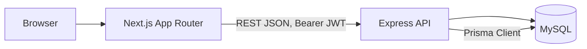

# Dhaka Tesla Pool — Master Implementation Plan

> Purpose: this is the build blueprint for the RoBenDevs "Dhaka Tesla Pool" ride-pooling MVP
> assessment. Follow it top to bottom, phase by phase. Each phase = one or more git feature
> branches. Do not skip Phase 0 (design docs) — the brief explicitly grades "architecture first".
>
> **Rev 2 note:** this revision corrects the pool/ride relationship model, separates pool
> matching from driver acceptance, fixes fare arithmetic to integer-only, and makes the
> concurrency plan Prisma-specific. See Section 12 for the full assumptions log.
>
> **Rev 3 note:** Section 8 carries a live `Status` field per phase (values: `NOT STARTED`,
> `IN PROGRESS`, `IMPLEMENTED on <branch>`, `COMPLETE`) and is the authoritative phase sequence —
> phase numbers are fixed and must not be renumbered as work lands. Keep `docs/PROGRESS.md` in
> sync with these statuses as they change.
>
> **Rev 4 note (this cross-check pass):** folded Section 13's engineering-judgment additions and
> Section 6.2's grace-window cancellation into their owning phases below, restored the
> `GET /api/zones` endpoint and Phase-status tracking (both were dropped in an earlier file
> overwrite), and updated phase statuses to match current repo reality: **Phase 0–3 are COMPLETE**
> (Phase 3 merged to `master`), **Phase 4 is NEXT**.
>
> **Rev 5 note (status correction, not silently applied):** the Rev 4 "Phase 4 is NEXT" line was
> stale the moment it was written — Phases 4–8 had already been merged into `master` via work done
> directly against this plan outside this chat. Statuses below are corrected accordingly. Separately,
> a repo audit found that despite Section 0 marking Section 13 (13.1/13.2/13.6) and Section 6.2 as
> "part of the plan, not optional," four of those items were never actually implemented even though
> `docs/PROGRESS.md` had Phases 3 and 6 marked complete: idempotency-key dedup, one-active-ride
> enforcement, `seats_requested` bounds, and grace-window cancellation. All four have since been
> backfilled (schema migration `20260923110514_add_idempotency_and_grace_window_cancellation`,
> 68/68 tests passing, verified live against MariaDB) — see the Phase 3/6 status notes below. This
> is the exact failure mode Section 0's "not optional" line exists to prevent; the fix is recorded
> here rather than quietly assumed to have already been true.

---

## 0. Non-negotiables (re-read before every phase)

- Stack: **Node.js (Express) backend, Next.js (App Router) frontend, MySQL, Prisma ORM**
- Money stored as **integer paisa**, never float/decimal — no `*0.15`, use `floor(x * 15 / 100)`
- Story cast only: **Jashim (driver), Bullet (Tesla, capacity 3), Nusrat, Rafiq, Shirin (passengers)** — never `user1`/`driver1`
- **`RideRequest.status`** (passenger journey) and **`Pool.status`** (Tesla's shared trip) are separate state machines — never conflated
- Passenger lifecycle: `REQUESTED → MATCHED → DRIVER_ARRIVED → STARTED → COMPLETED` (+ `CANCELLED` from `REQUESTED`/`MATCHED` only)
- Pool lifecycle: `OPEN → MATCHED → DRIVER_ARRIVED → STARTED → COMPLETED` (+ `CANCELLED` from `OPEN`/`MATCHED`)
- A ride request being grouped into a pool is **not** the same event as the passenger being matched — matching happens only when a driver accepts the pool (Section 3.1)
- `pool_memberships` is the **only** relationship between `pools` and `ride_requests` — no redundant FK on `ride_requests`
- Branch model: `master`, `pre-release`, `release/v1.0.0`, `feature/*`, merged with `--no-ff`
- Commit format: `type(scope): short description` — never "update"/"fix"/"final"
- No microservices/Kafka/Redis/queues unless justified in the bonus scaling section only
- Docker Compose must bring up everything with one command
- Section 13 (idempotency, one-active-ride, stale-pool policy, centralized errors, security
  baseline, seat bounds) and Section 6.2 (grace-window cancellation) are **part of the plan, not
  optional extras** — each is assigned to a specific phase above and belongs in that phase's
  acceptance criteria, not deferred as a "nice to have"

---

## 1. Tech Stack & Justification (put this almost verbatim in README §7)

| Layer | Choice | Why | Alternative considered | Would switch if... |
|---|---|---|---|---|
| Backend | Express | Minimal boilerplate, fast to reason about for a small MVP, team already fluent in it | NestJS (more structure but steeper setup cost for this scope) | Team/codebase grows past ~15 endpoints and needs enforced module boundaries |
| DB | MySQL (InnoDB) | Relational integrity + real FK constraints; InnoDB gives transactions and row-level locking (`SELECT ... FOR UPDATE`) needed for seat-capacity concurrency; widest free-tier hosting availability (PlanetScale, Railway, Aiven) | PostgreSQL (slightly stronger isolation defaults, native JSON/array types), SQLite (no real concurrency story) | Need heavy geospatial queries at scale, or stricter isolation guarantees → PostgreSQL + PostGIS |
| ORM | Prisma | Schema-first, migrations built-in, type-safe queries, works identically across MySQL/Postgres, fast to demo/explain | Knex (more manual), TypeORM (heavier) | N/A for this scope |
| Auth | JWT + bcrypt | Stateless, simple to reason about for an MVP with two roles | Session-based auth (needs sticky store) | Multi-device session revocation becomes a real requirement |
| Validation | Zod | Type inference + runtime validation in one place | Joi | N/A |
| Frontend | Next.js App Router | File-based routing, recommended by brief | Plain React + React Router | N/A |
| Styling | Tailwind CSS | Fast, matches your existing experience | CSS Modules | N/A |
| Tests | Jest + Supertest (backend), Vitest/RTL (frontend, optional) | Standard, fast to set up | Mocha/Chai | N/A |
| Hosting | Frontend: **Vercel**. Backend: **Render free web service**. Database: **Aiven for MySQL free tier**. Verified current as of this deployment pass — Railway now requires $1/mo after a 30-day trial (not free), PlanetScale discontinued its free tier in 2024 — both dropped from consideration | Aiven's MySQL free tier is genuinely free indefinitely, no card required (official docs confirm no time limit); Render's free web service spins down on idle (~1 min cold-start, documented as a known limitation) | Railway/PlanetScale (both ruled out, see left) | Re-verify at actual deploy time regardless — free-tier terms change; this table reflects a specific verification pass, not a permanent guarantee |

### 1.1 Authentication Details

- **JWT payload (minimal, no PII beyond what's needed for authorization):**
  ```json
  { "sub": "user-id", "role": "PASSENGER" }
  ```
  Do not put email, name, or anything sensitive in the token — it's not encrypted, only signed.
- **Token storage/transport (MVP assumption — label this in `docs/decisions.md`):** the frontend
  (Next.js) and backend (Express) are two separate services, so a cross-origin `httpOnly` cookie
  setup adds real complexity (SameSite/CORS credentials configuration) for a 2-week MVP. This plan
  uses **`Authorization: Bearer <token>`**, with the token held in a React context/provider on the
  client and persisted to `localStorage` so a page refresh doesn't force re-login.
  - **Trade-off, state this honestly in README:** `localStorage` tokens are readable by any script
    on the page (XSS risk) whereas `httpOnly` cookies are not. This is an accepted MVP trade-off.
  - **Do not claim SSR authentication.** Because the token lives in `localStorage` (client-only,
    not sent automatically with the initial HTML request), Next.js server components cannot read
    it. Any page that needs auth-aware data renders as a **client component** (`"use client"`)
    and fetches after mount. If true SSR-authenticated pages are needed later, that requires
    moving to `httpOnly` cookies with a same-site proxy — documented as a known limitation, not
    implemented in this MVP.

---

## 2. Architecture (Phase 0 deliverable — commit to `docs/architecture.md` on `master` early)



Layers:
- **Presentation:** Next.js — passenger flow, driver flow, shared components
- **API:** Express — route handlers → controllers → services → Prisma repository calls
- **Business logic location:** service layer only (never in route handlers, never in Prisma calls directly) — this is a scored item ("business-logic placement")
- **Persistence:** MySQL via Prisma, migrations checked into repo

---

## 3. Database Schema (ERD) — commit to `docs/erd.md`

```mermaid
erDiagram
    USERS ||--o{ TESLAS : owns
    USERS ||--o{ RIDE_REQUESTS : requests
    TESLAS ||--o{ POOLS : serves
    POOLS ||--o{ POOL_MEMBERSHIPS : contains
    RIDE_REQUESTS ||--o| POOL_MEMBERSHIPS : "belongs to"
    RIDE_REQUESTS ||--o{ RIDE_STATUS_HISTORY : logs
    ZONES ||--o{ RIDE_REQUESTS : "pickup/destination"

    USERS {
        uuid id PK
        string name
        string email UK
        string password_hash
        enum role "passenger|driver"
        string phone
        datetime created_at
    }
    TESLAS {
        uuid id PK
        uuid driver_id FK, UK "one Tesla per driver — MVP assumption"
        string name
        int capacity
        enum status "online|offline"
        datetime created_at
    }
    ZONES {
        uuid id PK
        string name UK
        string cluster
    }
    RIDE_REQUESTS {
        uuid id PK
        uuid passenger_id FK
        uuid pickup_zone_id FK
        uuid destination_zone_id FK
        int seats_requested
        enum status "REQUESTED|MATCHED|DRIVER_ARRIVED|STARTED|COMPLETED|CANCELLED"
        int estimated_fare_paisa "set at creation, no pool discount"
        int fare_paisa "nullable; finalized when the pool is MATCHED"
        boolean late_cancellation "default false; see Section 6.2"
        int cancellation_fee_paisa "nullable; computed not charged, see Section 6.2"
        datetime requested_at
        datetime matched_at
        datetime arrived_at
        datetime started_at
        datetime completed_at
        datetime cancelled_at
    }
    POOLS {
        uuid id PK
        uuid tesla_id FK
        enum status "OPEN|MATCHED|DRIVER_ARRIVED|STARTED|COMPLETED|CANCELLED"
        int seats_occupied "aggregate counter — see 3.2"
        datetime created_at
        datetime matched_at
        datetime completed_at
    }
    POOL_MEMBERSHIPS {
        uuid id PK
        uuid pool_id FK
        uuid ride_request_id FK UK "one ride request cannot join two pools"
        int seats "per-passenger allocation — see 3.2"
        datetime created_at
    }
    RIDE_STATUS_HISTORY {
        uuid id PK
        uuid ride_request_id FK
        string from_status
        string to_status
        datetime changed_at
        uuid changed_by FK
    }
```

**Key constraints (implement at DB level, not just app level):**
- `ride_requests` has **no `pool_id` column.** `pool_memberships` is the sole join table between
  `pools` and `ride_requests` — this removes the redundant/duplicate relationship that existed in
  Rev 1. To find a ride request's pool: `pool_memberships.where(ride_request_id = ...)`.
- `pool_memberships.ride_request_id` is **UNIQUE** — enforces that one ride request can never be a
  member of two pools simultaneously (this is now the *only* place that invariant is enforced).
- `teslas.driver_id` is **UNIQUE** — MVP assumes one Tesla per driver (documented assumption,
  Section 12). Driver authorization checks must verify both role AND ownership (Section 7.1).
- `teslas.capacity` = fixed int (e.g. 3), CHECK `capacity > 0` (MySQL 8.0.16+ enforces CHECK
  constraints; confirm your target MySQL version supports it, older versions silently ignore them)
- `pools.seats_occupied` must never exceed `teslas.capacity` — enforced primarily via transaction +
  row lock (Section 6); a CHECK constraint is a second line of defense only, don't rely on it alone
  since app-level enforcement is what's actually being graded
- FK indexes on all FK columns (`driver_id`, `pickup_zone_id`, `pool_id`, `ride_request_id`, etc.)
- `zones.cluster` — predefined grouping used for matching rule (Section 4)

### 3.1 Domain Model: Matching vs. Driver Acceptance (corrects Rev 1's conflation)

These are **two distinct events**, and the brief explicitly requires they not be conflated:

```
REQUESTED
   ↓
compatible OPEN pool found (or a new OPEN pool created)
   → a pool_membership row is inserted; ride_request.status stays REQUESTED
   ↓
pool becomes visible to the owning driver (GET /api/driver/requests)
   ↓
driver explicitly accepts the pool  (POST /api/driver/pools/:poolId/accept)
   ↓
pool.status: OPEN → MATCHED
   → cascades: every current member's ride_request.status REQUESTED → MATCHED
   → cascades: fare_paisa finalized for every member (Section 5.2)
   → no further ride_requests may join this pool after this point
```

**Why this separation matters:** grouping requests into a pool is a system-side optimization step
(finding who *could* share a ride); acceptance is the driver's business decision to actually take
that trip. Treating pool assignment as "matched" would let a passenger see `MATCHED` status before
any driver has actually committed to picking them up — misleading and wrong per the brief's own
lifecycle table.

### 3.2 Domain Model: Pool State vs. Ride Request State

- **`RideRequest.status`** represents one passenger's individual journey — what *they* see.
- **`Pool.status`** represents the Tesla's shared trip container — what the *driver* sees and
  drives through the stages.
- Pool lifecycle: `OPEN → MATCHED → DRIVER_ARRIVED → STARTED → COMPLETED` (+`CANCELLED` from
  `OPEN`/`MATCHED`).
  - `OPEN`: accepting compatible ride requests, not yet accepted by a driver.
  - `MATCHED`: a driver has accepted; membership is locked, no further joins.
  - `DRIVER_ARRIVED` / `STARTED` / `COMPLETED`: trip stages, driver-driven, cascade to all member
    ride_requests (Section 7).
  - `CANCELLED`: pool cancelled (e.g. it becomes empty after the last member cancels).
- **Deliberately no separate `FULL` status** (unlike the brief's example enum). "Full" is a
  *computed* condition — `pool.seats_occupied >= tesla.capacity` — checked by the matching service
  when deciding whether an `OPEN` pool can accept one more request. Persisting it as its own status
  would be a duplicated state with no additional transition behavior attached to it, which Section
  16 of the brief specifically warns against. This is documented as an MVP assumption (Section 12).
- When a pool transitions `DRIVER_ARRIVED`/`STARTED`/`COMPLETED`, every member ride_request with an
  active (non-cancelled) status moves in lockstep, and one `ride_status_history` row is written per
  affected ride_request (Section 7).

### 3.3 `seats_occupied` vs. `pool_memberships.seats`

- `pool_memberships.seats` = the seat count allocated to **one specific passenger's** membership row.
- `pools.seats_occupied` = a **maintained aggregate counter** on the pool, equal to the sum of all
  its active memberships' `seats`. It exists purely so a capacity check is a single indexed row
  read (`SELECT seats_occupied FROM pools WHERE id = ? FOR UPDATE`) instead of a `SUM()` aggregate
  query on every seat-claim attempt — this matters under the concurrency scenario in Section 6.
- **This is intentional, acceptable duplication for the MVP**, not a normalization mistake — but it
  only stays correct if every write that touches membership seats also updates the counter **in the
  same database transaction**. There is exactly one code path allowed to mutate `seats_occupied`:
  the pool-membership service, and it always does so inside the transaction described in Section 6.
  Document this rule explicitly in README's "Key Decisions" section.

---

## 4. Predefined Zones & Matching Rule (document in README §4)

Seed zones (flat list, no real geo): Banani, Gulshan, Mohakhali, Dhanmondi, Mirpur, Uttara, Farmgate, Bashundhara.

**Matching rule (deterministic, testable, no map API):** two ride requests are pool-compatible
if **all** of the following hold:

1. `pickup_zone.cluster` is identical for both requests
2. `destination_zone.cluster` is identical for both requests
3. `existing_pool.seats_occupied + new_request.seats_requested <= tesla.capacity`

Each `zone` row carries a single `cluster` label, and the rule is applied independently to the
pickup zone and the destination zone of each request — it does not require the pickup and
destination to share a cluster with *each other*, only that both requests agree pairwise on each
leg. This keeps the rule a plain equality check on two columns, fully unit-testable without any
distance math.

**Example cluster:** `"Gulshan-Mohakhali corridor"` contains Gulshan, Mohakhali, Banani.

**Why Nusrat and Rafiq match:** Nusrat is Banani → Mohakhali, Rafiq is Banani → Gulshan 1.
- Pickup: both `Banani` → same pickup zone → trivially same cluster. ✅
- Destination: `Mohakhali` and `Gulshan 1` are both members of the `"Gulshan-Mohakhali corridor"`
  cluster → same destination cluster. ✅
- Seats: both request 1 seat, Bullet has capacity 3, 0 currently occupied → 2 ≤ 3. ✅

All three conditions hold, so the matching service places them in the same `OPEN` pool.

---

## 5. Fare Model (integer arithmetic only — must be hand-calculable)

```
distanceChargePaisa = distanceKm(pickup_zone, destination_zone) * ratePerKmPaisa
poolDiscountPaisa    = floor(baseFarePaisa * 15 / 100)        // NOT baseFare * 0.15
```

- `baseFarePaisa` = 3000 (৳30)
- `ratePerKmPaisa` = 1500 (৳15/km)
- Zone-to-zone distance: hardcoded lookup table (no map API) — seed a small `zone_distance` table
  or a JS constant map, values in whole km (integers)
- **All monetary math uses integer paisa and integer/floor division — never a float literal like
  `0.15` in the codebase.** Use `Math.floor(baseFarePaisa * 15 / 100)` (Node integers up to this
  size are exact; for larger amounts use `BigInt` if you want to be extra safe, not required at MVP
  fare sizes).

### 5.1 Estimated Fare vs. Final Pooled Fare (corrects Rev 1's ambiguity)

- **`estimated_fare_paisa`** — computed and stored **at ride-request creation** (`POST /api/rides`),
  **without** `poolDiscountPaisa` applied. This is what the passenger sees immediately: "your
  estimated fare is ৳XX.XX, may be lower if pooled."
- **`fare_paisa`** — starts `NULL`. It is computed and written **once**, at the moment the pool
  transitions `OPEN → MATCHED` (driver accepts, Section 3.1), using the final membership count at
  that instant:
  - If the pool has **2 or more** active members at acceptance time → each member's `fare_paisa` =
    `baseFarePaisa + distanceChargePaisa - poolDiscountPaisa` for *their own* distance.
  - If the pool has exactly **1** member at acceptance time (no one ever pooled with them) →
    `fare_paisa` = `estimated_fare_paisa` (no discount).
  - **MVP assumption, documented in Section 12:** fare is finalized once, at `MATCHED`, not
    recalculated on every membership join beforehand. This keeps the calculation a single,
    testable step instead of a running recomputation.

### 5.2 Worked Example (must match test assertions exactly)

Nusrat (Banani→Mohakhali, 3km) & Rafiq (Banani→Gulshan1, 4km), pooled together, pool reaches
`MATCHED` with both as members:

```
poolDiscountPaisa = floor(3000 * 15 / 100) = floor(450) = 450

Nusrat: 3000 + (3 * 1500) - 450 = 3000 + 4500 - 450 = 7050 paisa = ৳70.50
Rafiq:  3000 + (4 * 1500) - 450 = 3000 + 6000 - 450 = 8550 paisa = ৳85.50
```

These numbers are unchanged from Rev 1 — only the arithmetic path (floor/integer instead of a
float literal) and the *timing* of when they're written (`fare_paisa` at `MATCHED`, not at request
creation) changed.

---

## 6. Concurrency Handling (Prisma-specific — Section 14 of the brief, be ready to defend in interview)

**Scenario:** Bullet has 1 seat left. Nusrat and Shirin both hit "claim seat" near-simultaneously.

**MVP solution, Prisma-specific:**

```
prisma.$transaction(async (tx) => {
  // Prisma's high-level API has no built-in FOR UPDATE — raw SQL is required for MySQL row locks.
  const [pool] = await tx.$queryRaw`
    SELECT id, seats_occupied FROM pools WHERE id = ${poolId} FOR UPDATE
  `;

  const tesla = await tx.tesla.findUnique({ where: { id: pool.teslaId } });

  if (pool.seats_occupied + requestedSeats > tesla.capacity) {
    throw new SeatsUnavailableError(); // transaction rolls back, caller returns 409
  }

  await tx.poolMembership.create({
    data: { poolId, rideRequestId, seats: requestedSeats },
  });

  await tx.$executeRaw`
    UPDATE pools SET seats_occupied = seats_occupied + ${requestedSeats} WHERE id = ${poolId}
  `;
});
```

- **The row lock must be acquired and held for the lifetime of this transaction.** `SELECT ... FOR
  UPDATE` only takes effect inside an explicit transaction — `prisma.$transaction(...)` (interactive
  transaction callback) provides that boundary; a bare `prisma.pool.findUnique()` outside a
  transaction does **not** lock anything, even if you intended it to.
- Because Prisma's query builder does not expose `FOR UPDATE` directly, `tx.$queryRaw` is required
  for the locking read, and `tx.$executeRaw` (or a normal `tx.pool.update`) for the counter
  increment — **document this explicitly in README**, it's a real Prisma/MySQL limitation, not an
  oversight.
- This serializes both requests at the DB row level — the second request's `SELECT ... FOR UPDATE`
  blocks until the first transaction commits or rolls back, then re-reads the updated
  `seats_occupied` and correctly fails.

**Document in README:** "At MVP scale, a MySQL (InnoDB) row lock inside a Prisma interactive
transaction is sufficient and simple to reason about, **with one caveat found the hard way**
(Section 6.3): a straightforward `FOR UPDATE` lock is not automatically enough under InnoDB's
default `REPEATABLE READ` isolation when a transaction reads *before* taking the lock — that earlier
read can pin a stale snapshot. `matchRideRequest` and `cancelRideRequest` explicitly use
`READ COMMITTED` for this reason (Section 6.3). At larger scale (Section 10 bonus) this would move
to a Redis-backed distributed lock or a single-writer queue per Tesla to avoid DB contention under
high concurrency."

### 6.3 A Real Isolation-Level Bug Found in CI (not a hypothetical — document this for the interview)

**What the original Section 6 claim got wrong:** the text above used to assert that InnoDB's default
`REPEATABLE READ` isolation "prevents the double-claim" on its own. That's true for the simple
seat-count-increment path shown in the code block above, but it turned out **not** to be true for
`matchRideRequest`'s full flow, and CI against real MySQL 8 caught it — a smoke test that only hit
`/health` and `/api/zones` never would have.

**The actual bug:** `matchRideRequest`'s transaction does an initial read ("does this Tesla already
have an `OPEN` pool?") *before* it takes the `FOR UPDATE` lock on the Tesla row later in the same
transaction. Under `REPEATABLE READ`, a transaction's first read pins a consistent snapshot for the
*rest* of that transaction — so even though the later `FOR UPDATE` correctly blocks the second
transaction until the first commits, once it's unblocked it can still be looking at the **pre-commit
snapshot** for that earlier "does a pool already exist" check. Result: two passengers requesting
concurrently could each create their own `OPEN` pool for the same Tesla — a genuine violation of
"one active pool per Tesla," reproduced with a real concurrent Nusrat+Rafiq integration test against
MySQL 8, not caught by unit tests against MariaDB.

**The fix:** `matchRideRequest` and `cancelRideRequest` explicitly run under `READ COMMITTED`
isolation (Prisma: `prisma.$transaction(fn, { isolationLevel: Prisma.TransactionIsolationLevel.ReadCommitted })`)
instead of InnoDB's default. `READ COMMITTED` re-reads fresh data on every statement within the
transaction rather than pinning a snapshot at the first read, so the post-lock existence check sees
the real, current state. The `FOR UPDATE` lock itself still does the actual serialization — the
isolation-level change fixes what the transaction *sees*, not what it locks.

**Related fix bundled in:** the loser of the Tesla-pool race now retries to join (or create) a
different pool instead of silently falling through to an unpooled ride request.

**Why this belongs in the video/interview answer:** "I used a row lock" is the surface-level answer
every candidate gives. "I used a row lock, and separately had to fix a snapshot-isolation gap that
only showed up under real concurrent load against the actual target database" is the answer that
demonstrates the difference between copying a pattern and understanding why it works. Independent
confirmation: a second AI agent (GitHub Copilot, working in parallel on the same repo) reached the
identical root-cause diagnosis and fix independently — worth mentioning as a data point, not as
proof, since agreement between two AI tools reduces the chance this was a one-off misdiagnosis but
doesn't replace the human review that actually decided which fix to ship.

### 6.1 Cancellation & Seat Release (new — corrects Rev 1's missing spec)

`POST /api/rides/:id/cancel`, passenger-owned, allowed **only** from `REQUESTED` or `MATCHED`
(explicitly rejected — 409 — from `DRIVER_ARRIVED`, `STARTED`, `COMPLETED`). All of the following
happen **atomically in one Prisma transaction**:

1. Re-check current `ride_request.status` inside the transaction (avoid a stale-read race with a
   driver simultaneously advancing the pool).
2. Set `ride_request.status = CANCELLED`, `cancelled_at = now()`.
3. **Compute `late_cancellation` (Section 6.2)** before continuing: `false` if cancelling from
   `REQUESTED`; if cancelling from `MATCHED`, `true` when `cancelled_at - matched_at` exceeds the
   grace window, else `false`. Write it on the same row update as step 2 — no extra query.
4. If a `pool_membership` row exists for this ride request: delete it, and decrement the parent
   pool's `seats_occupied` by that membership's `seats` — same transaction, same row-lock pattern as
   Section 6 (`SELECT ... FOR UPDATE` on the pool row before decrementing).
5. If, after removal, the pool has **zero** active memberships:
   - if `pool.status` was `OPEN` → set `pool.status = CANCELLED`
   - if `pool.status` was `MATCHED` (driver already accepted, then the only/last passenger
     cancelled) → also set `pool.status = CANCELLED` (nothing left for the driver to drive)
6. Write a `ride_status_history` row for the cancellation.
7. **Known MVP limitation, document in README:** if a passenger cancels *after* `MATCHED` while
   other members remain, their `fare_paisa` is **not** retroactively recalculated for the
   remaining passengers (fare was finalized once, per Section 5.1). Flag this as a "next
   improvement," not a silent bug.

**Required tests:** cancel from `REQUESTED` succeeds and releases no membership (none existed
yet, or one existed pre-match); cancel from `MATCHED` releases membership and decrements
`seats_occupied`; cancel from `DRIVER_ARRIVED`/`STARTED`/`COMPLETED` is rejected with 409; cancelling
the last member of a pool cancels the pool too.

### 6.2 Grace-Window Cancellation (senior-engineering addition, Section 13-style)

**Why this exists:** the brief mandates that passengers can self-cancel from both `REQUESTED` and
`MATCHED` (raw PRD lifecycle diagram) — this is non-negotiable and must not be restricted.
However, an unconditional "cancel any time with zero consequence" also isn't how real ride-pooling
products behave once a driver has committed. The realistic, defensible middle ground: **never
block the cancellation, but honestly flag when it was costly.**

```
GRACE_WINDOW_SECONDS = 60   // env-configurable constant, documented in .env.example

On cancel from REQUESTED:
    late_cancellation = false                          // driver never committed, always free

On cancel from MATCHED:
    elapsed = cancelled_at - pool.matched_at
    late_cancellation = elapsed > GRACE_WINDOW_SECONDS
    if late_cancellation:
        cancellation_fee_paisa = floor(fare_paisa * 20 / 100)   // computed, integer, NOT charged
```

- `cancellation_fee_paisa` is **computed and stored for demonstration purposes only** — this MVP
  has no real payment gateway (per the brief, cash/simulated TeslaPay), so nothing is actually
  deducted. State this explicitly in README's "Key Decisions" section: "a late-cancellation fee is
  computed and recorded to demonstrate the production pattern; actual deduction against a
  TeslaPay wallet balance is out of scope for this MVP and listed under Next Improvements."
- **Worked example for the video:** Nusrat cancels 30s after `MATCHED` → free, no flag. Rafiq
  cancels 90s after `MATCHED` → `late_cancellation = true`, fee computed on his `fare_paisa`
  (8550 paisa → floor(8550*20/100) = 1710 paisa recorded, not charged).
- **Required tests:** cancel within grace window → `late_cancellation = false`, no fee; cancel past
  grace window → `late_cancellation = true`, fee computed correctly with integer arithmetic;
  cancel from `REQUESTED` (any elapsed time) → always `late_cancellation = false`.
- **Explicitly out of scope, documented as a known limitation:** driver-initiated cancellation
  (no-show, emergency) is not implemented in this MVP — the brief doesn't require it, and adding
  it would be scope creep. Note it under README's "Next Improvements."

---

## 7. API Endpoint Contract

### 7.1 Authentication & Authorization (applies to every row below)

- Every non-public route requires `Authorization: Bearer <jwt>`; payload shape in Section 1.1.
- **Passenger-owned resources:** a passenger may only read/act on `ride_requests` where
  `passenger_id = req.user.sub`. Enforced in the service layer, tested explicitly (Section 9).
- **Driver-owned resources:** a driver may only read/act on `teslas`/`pools` where
  `teslas.driver_id = req.user.sub`. A driver must never modify another driver's Tesla or pool —
  since `teslas.driver_id` is UNIQUE, this check is a single equality comparison, not a search.

| Method | Path | Role | Purpose |
|---|---|---|---|
| POST | `/api/auth/signup` | public | create passenger or driver |
| POST | `/api/auth/login` | public | returns JWT |
| POST | `/api/teslas` | driver | register Bullet (name, capacity) — rejected if driver already owns one (UNIQUE) |
| PATCH | `/api/teslas/:id/status` | driver (own) | online/offline |
| GET | `/api/zones` | public | list predefined zones (name + cluster) — needed for pickup/destination dropdowns on the frontend; surfaced during Phase 3, added here |
| POST | `/api/rides` | passenger | request ride (pickup, destination, seats) → creates `REQUESTED` ride_request, computes `estimated_fare_paisa`, runs matching service (Section 3.1/4). Accepts optional `Idempotency-Key` header (Section 13.1); rejected (409) if the passenger already has an active ride (Section 13.2) |
| GET | `/api/rides/:id` | passenger (own) | status + estimated/final fare |
| GET | `/api/rides` | passenger | own ride history |
| POST | `/api/rides/:id/cancel` | passenger (own) | only valid from `REQUESTED`/`MATCHED` — see Section 6.1; response includes `late_cancellation` and `cancellation_fee_paisa` when applicable (Section 6.2) |
| GET | `/api/driver/requests` | driver | `OPEN` pools/requests visible/matchable to their online Tesla |
| POST | `/api/driver/pools/:poolId/accept` | driver (own) | `OPEN → MATCHED` — cascades ride_request status + finalizes fares (Section 3.1, 5.1) |
| PATCH | `/api/driver/pools/:poolId/status` | driver (own) | body `{ status: DRIVER_ARRIVED \| STARTED \| COMPLETED }` — pool-level, cascades to every active member ride_request + writes history rows (Section 3.2) |
| GET | `/api/driver/pools/:id` | driver (own) | passengers + seats + status for one pool |
| GET | `/api/driver/history` | driver | pools/trips (any terminal or in-progress) tied to the authenticated driver's Tesla |

**Why trip-stage transitions moved from `PATCH /api/rides/:id/status` (Rev 1) to
`PATCH /api/driver/pools/:poolId/status` (Rev 2):** `DRIVER_ARRIVED`/`STARTED`/`COMPLETED` are
physically true for the whole Tesla at once — the driver doesn't arrive separately for each
passenger. Modeling it as a per-ride endpoint would let inconsistent states creep in (one
passenger `STARTED`, another still `MATCHED`, same physical car). The pool-level endpoint is the
single source of truth for trip-stage changes; it fans out to member `ride_requests` and writes one
`ride_status_history` row per affected passenger inside the same transaction.

---

## 8. Phase-by-Phase Build Order (each = feature branch, merge to `master` with `--no-ff`)

> **Phase numbering is authoritative and fixed.** Do not renumber already-completed phases. The
> `Status` line on each phase is the live tracker — keep it in sync with `docs/PROGRESS.md`, update
> it as work actually lands (do not mark a phase complete unless it's implemented and verified).
> Allowed status values: `NOT STARTED`, `IN PROGRESS`, `IMPLEMENTED on <branch>`, `COMPLETE`.

### Phase 0 — Project Documentation & Architecture
**Branch:** commits directly to `master`, small doc-only commits
**Status:** COMPLETE
- [x] `docs/architecture.md` with the mermaid diagram (Section 2)
- [x] `docs/erd.md` with the mermaid ERD (Section 3) plus the 3.1/3.2/3.3 domain-model notes
- [x] `docs/fare-model.md` with the worked example (Section 5.2)
- [x] Matching rules documented (Section 4)
- [x] `docs/decisions.md` — seeded with the assumptions in Section 12, keep appending as you build
- [x] README baseline (see `DOCUMENTATION_PLAN.md`)
- [x] `docs/PROGRESS.md` initialized
- [x] Git repository / branch structure aligned (`master`, `pre-release`, `release/v1.0.0` exist)

### Phase 1 — Project Scaffold & Infrastructure Baseline
**Branch:** `feature/project-scaffold`
**Status:** COMPLETE
- [x] Monorepo or two-folder structure: `/backend`, `/frontend`
- [x] Express app skeleton
- [x] Next.js App Router skeleton
- [x] Prisma init (`provider = "mysql"`), environment configuration, database connection config
- [x] `.env.example`, docker-compose skeleton (app + mysql only, no migrations yet)
- [x] Shared dev configuration (lint/format), baseline test config (Jest/Supertest wired but empty)
- [x] Basic project scripts (`dev`, `build`, `test`, `lint`)
- [x] Initial health-check endpoint (`GET /health`)
- [x] Local development setup documented
- [x] **Centralized error envelope + request-correlation middleware (Section 13.4)** — built here
      so every later phase throws `AppError` instead of inventing its own response shape
- [x] **Security baseline middleware (Section 13.5)** — `helmet`, `cors` allowlist,
      `express-rate-limit` on `/api/auth/*` only
- [x] Commit: `build(scaffold): initial backend/frontend structure`
- [x] Did not duplicate Phase 2 functionality — scaffold only, no `users`/`teslas` tables or auth
      routes landed here

### Phase 2 — Authentication & Tesla Management
**Branch:** `feature/passenger-auth` (merged)
**Status:** COMPLETE — implemented and verified against local MariaDB 10.4.32 (dev DB); **must be
re-verified against real MySQL 8 in Phase 9** before relying on it for deployment (see Section 12
item 8 / the MariaDB-vs-MySQL flag below)
- [x] `users` table, roles, signup/login endpoints, JWT middleware (payload per Section 1.1)
- [x] bcrypt password hashing
- [x] Zod validation on auth endpoints
- [x] `teslas` table with `driver_id UNIQUE`, driver-only Tesla creation, Tesla ownership authorization
- [x] Tesla online/offline status toggle
- [x] Seed script: Jashim, Bullet(capacity 3), Nusrat, Rafiq, Shirin
- [x] Tests: signup validation, login success/failure, JWT required on protected routes,
      Tesla-ownership uniqueness (reject a second Tesla for a driver who already owns one)
- [ ] **Carry-forward action item:** confirm this phase's tests also pass against MySQL 8 (not
      just MariaDB) once Phase 9's Docker `mysql:8` service exists — do not assume compatibility

### Phase 3 — Ride Request
**Branch:** `feature/ride-request` (merged)
**Status:** COMPLETE — merged into `master`, 31/31 tests passing originally; **corrected via
backfill** (migration `20260923110514_add_idempotency_and_grace_window_cancellation`) after a repo
audit found `Idempotency-Key` support, one-active-ride enforcement, and `seats_requested` bounds
were marked done here but not actually implemented — now genuinely implemented and verified live,
68/68 tests passing. See Rev 5 note above.
- [x] `zones` table + seed (Banani, Gulshan, Mohakhali, Dhanmondi, Mirpur, Uttara, Farmgate, Bashundhara) with `cluster` field
- [x] `ride_requests` table (no `pool_id` column — Section 3)
- [x] `GET /api/zones` — added mid-phase for frontend dropdown support (documented, Section 7)
- [x] `POST /api/rides` — validates pickup/destination/seats, computes `estimated_fare_paisa`
      (no discount, Section 5.1), status = `REQUESTED`
- [x] `Idempotency-Key` support on `POST /api/rides` (Section 13.1)
- [x] One-active-ride-per-passenger enforcement (Section 13.2)
- [x] `seats_requested` bounded to `1..3` via Zod (Section 13.6)
- [x] Passenger ownership enforced on all ride-request reads
- [x] Tests: `estimated_fare_paisa` unit test verified live (Nusrat Banani→Mohakhali →
      `estimatedFarePaisa: 7500`, matches Section 5.2 exactly), floor/integer math verified (no
      floating-point assertions), ownership tests, idempotency test, one-active-ride test, seat
      bounds test
- [x] Zone clusters and the zone-distance matrix filled in beyond the two worked-example values —
      logged in `docs/decisions.md` as an MVP assumption (only 1/8 clusters and 2/28 distances were
      specified in this plan; the rest were filled in consistently and documented)

### Phase 4 — Tesla Pooling & Matching
**Branch:** `feature/tesla-pooling` (merged)
**Status:** COMPLETE — merged into `master` (Rev 4's "NEXT" was stale, corrected in Rev 5)
- [ ] `pools`, `pool_memberships` tables (`pool_memberships.ride_request_id UNIQUE`)
- [ ] Deterministic matching service (Section 4): given a new `ride_request`, find a compatible
      `OPEN` pool (same pickup cluster, same destination cluster, capacity available) or create a
      new `OPEN` pool. Inserts a `pool_membership` row; **ride_request.status stays REQUESTED**
      (Section 3.1) — pool creation/finding is not driver acceptance
- [ ] `GET /api/driver/requests` — lists `OPEN` pools visible to the driver's online Tesla
- [ ] `POST /api/driver/pools/:poolId/accept` — driver acceptance, `OPEN → MATCHED`, cascades
      ride_request status, finalizes `fare_paisa` for all current members (Section 5.1)
- [ ] Pool lifecycle guard: no new members once `MATCHED`
- [ ] Sanity-check the zone cluster/distance table filled in during Phase 3 against this phase's
      matching tests before relying on it further (per the Phase 3 carry-forward note above)
- [ ] Tests: Nusrat+Rafiq end up in the same `OPEN` pool and stay `REQUESTED` until accepted; a
      non-matching request (e.g. to Mirpur) does not join; after `accept`, both flip to `MATCHED`
      and get the exact individual fares from Section 5.2

### Phase 5 — Capacity, Transactions & Concurrency
**Branch:** `feature/capacity-enforcement` (merged)
**Status:** COMPLETE — merged into `master` (Rev 4's status was stale, corrected in Rev 5). Full
item-level checklist below reflects the plan's acceptance criteria; verify against `docs/PROGRESS.md`
in the repo for this phase's actual per-item confirmation, since chat-side visibility into this
merge is limited to "merged" rather than a detailed test report.
- [ ] Transaction boundaries defined for every capacity-sensitive operation (seat claim, cancellation)
- [ ] Wrap seat-claim in a Prisma interactive transaction using `$queryRaw`/`$executeRaw` for the
      Tesla/pool row-level `FOR UPDATE` lock (Section 6) — not a plain Prisma query, that would not lock
- [ ] Return 409 on overbooking attempt; capacity invariant (`seats_occupied <= capacity`) enforced
- [ ] **Concurrency/race-condition test:** simulate Nusrat + Shirin racing for the last seat (e.g.
      `Promise.all` of two claim calls), assert exactly one succeeds and `seats_occupied` never
      exceeds `capacity`
- [ ] Cancellation seat release implemented per Section 6.1 (same transactional pattern)
- [ ] Database consistency verification: after a burst of concurrent claims + cancellations in a
      test, assert `pools.seats_occupied` always equals the live sum of its `pool_memberships.seats`

### Phase 6 — Ride Lifecycle
**Branch:** `feature/ride-lifecycle` (merged)
**Status:** COMPLETE — merged into `master`; **corrected via backfill** alongside Phase 3 after
the same repo audit found grace-window cancellation (Section 6.2) marked done here but not
implemented — now genuinely implemented and verified live (68/68 tests, migration
`20260923110514_add_idempotency_and_grace_window_cancellation`). See Rev 5 note above.
- [ ] State machine guards for both `RideRequest.status` and `Pool.status` (Section 3.2) — reject
      invalid transitions on either
- [ ] `PATCH /api/driver/pools/:poolId/status` (Section 7) — cascades `DRIVER_ARRIVED`/`STARTED`/
      `COMPLETED` to every active member ride_request, writes one `ride_status_history` row per
      affected passenger, same transaction
- [ ] `POST /api/rides/:id/cancel` — full atomic flow from Section 6.1 (release membership,
      decrement `seats_occupied`, cancel empty pool, reject from `DRIVER_ARRIVED`/`STARTED`/`COMPLETED`)
- [ ] **Grace-window cancellation (Section 6.2)** — compute and persist `late_cancellation` +
      `cancellation_fee_paisa` as part of the same cancel transaction; nothing actually charged
- [ ] `GET /api/driver/history` — backend implementation (pools/trips tied to the driver's Tesla,
      any terminal or in-progress status); the frontend view for this is Phase 8, but the endpoint
      itself belongs here with the rest of the lifecycle/history work
- [ ] Tests: full valid lifecycle passes for a pooled pair, each invalid jump rejected on both
      state machines, cross-user access rejected (403), all Section 6.1 cancellation cases, all
      Section 6.2 grace-window cases, driver-history endpoint returns only the authenticated
      driver's own pools

### Phase 7 — Passenger Frontend
**Branch:** `feature/frontend-passenger-flow` (merged)
**Status:** COMPLETE — merged into `master` (Rev 4's status was stale, corrected in Rev 5). Verify
against `docs/PROGRESS.md` for per-item confirmation.
- [ ] Signup/login pages (JWT stored per Section 1.1, explicit `"use client"` on auth-aware pages)
- [ ] Request-ride form (pickup, destination dropdowns from `GET /api/zones`, seats) — shows
      `estimated_fare_paisa` immediately
- [ ] Status tracking page (poll or refetch) — shows `fare_paisa` once it's finalized (post-MATCHED)
- [ ] Cancellation control (only enabled from `REQUESTED`/`MATCHED`), surfaces `late_cancellation`
      messaging when applicable (Section 6.2)
- [ ] Ride history list
- [ ] Loading/error/empty states for every screen (explicitly scored)
- [ ] API integration against Phases 3/4/6 endpoints

### Phase 8 — Driver Frontend
**Branch:** `feature/frontend-driver-flow` (merged)
**Status:** COMPLETE — merged into `master` (Rev 4's status was stale, corrected in Rev 5). Verify
against `docs/PROGRESS.md` for per-item confirmation.
- [ ] Driver authentication (reuses Phase 2 auth UI where possible)
- [ ] Online/offline toggle
- [ ] Incoming/eligible pool-request list (`GET /api/driver/requests`)
- [ ] Accept pool → passenger/seat visibility (calling the pool-level accept endpoint)
- [ ] Arrival/start/complete controls (calling `PATCH /api/driver/pools/:poolId/status`, not a
      per-ride endpoint)
- [ ] Driver history view (`GET /api/driver/history`, backend from Phase 6)

### Phase 9 — Docker, Deployment & Integration
**Branch:** `feature/docker-deploy`, merged to local `master` (4 commits, not yet pushed to origin)
**Status:** IMPLEMENTED, `docker compose up` itself **not yet run live** — this machine has no
Docker available (confirmed on this side too). Everything short of an actual container run has
been verified: YAML syntax, line-by-line Dockerfile/entrypoint review, 68/68 unit + 1 integration
test on `master`, `next build`/`next start` and `node src/server.js` run directly on host.
Correctly flagged as a known limitation in README rather than claimed as tested — **recommended
next step:** add a minimal GitHub Actions workflow that runs `docker compose up -d` + a health-check
curl, so the one unverified piece gets a real CI run for free before Phase 10/11.
- [x] Dockerfiles for backend and frontend
- [x] Full `docker-compose.yml`: backend, frontend (optional container), **mysql:8**, healthchecks —
      includes `GRACE_WINDOW_SECONDS` env var (added this pass) and a backend healthcheck that
      waits for the backend to report healthy, not just started
- [x] Migrations run automatically on `docker compose up` (entrypoint script) — `prisma` moved to a
      regular `dependencies` entry so the CLI is present at runtime; **double-check `@prisma/client`
      is also in `dependencies`, not `devDependencies`**, before this is trusted
- [ ] Seed data loads automatically in dev mode — unconfirmed pending an actual container run
- [x] `.env.example` complete, no real secrets anywhere in repo
- [x] Production build verified (`next build`/`next start`, `node src/server.js` on host; stale
      `.next` cache issue hit and fixed, not a code bug)
- [ ] Free-tier deployment — not yet done (Phase 10)
- [ ] Integration verification against the actual Dockerized stack — blocked on Docker availability

### Phase 10 — Pre-release Stabilization
**Branch:** cut `pre-release` from `master` (`--no-ff`)
**Status:** NOT STARTED
- [ ] Full test pass (all phases' tests green together, not just individually)
- [ ] API review, security review, concurrency review
- [ ] Docker verification, deployment verification
- [ ] README completion: screenshots/GIFs, demo credentials, API documentation, known limitations
- [ ] AI Usage section filled in (per `DOCUMENTATION_PLAN.md` Section 2)
- [ ] Video preparation (script in `DOCUMENTATION_PLAN.md` Section 4)
- [ ] Integration bug fixes and documentation/deployment prep only — no new features on this branch

### Phase 11 — Release v1.0.0
**Branch:** cut `release/v1.0.0` from `pre-release` (`--no-ff`)
**Status:** NOT STARTED
- [ ] Record 6-minute video, link in README
- [ ] Final README polish, submission checklist pass (`DOCUMENTATION_PLAN.md` Section 7)
- [ ] Final release verification — this is the exact version demonstrated in the video/deployment

---

## 9. Test Checklist (map directly to brief's required coverage)

- [ ] Bullet's capacity can never be exceeded (concurrency test, Section 6)
- [ ] Invalid state transitions rejected — both `RideRequest.status` and `Pool.status` (Section 3.2, 6)
- [ ] Nusrat's and Rafiq's pooled fares calculate correctly, using the exact integer arithmetic
      from Section 5.2, asserted only after the pool reaches `MATCHED`
- [ ] A user cannot read/modify another user's ride, or another driver's Tesla/pool (authz tests,
      Section 7.1)
- [ ] Cancellation rules hold — every case in Section 6.1 (valid states, owner-only, seat release,
      empty-pool cancellation)
- [ ] Two concurrent requests for the last seat can't corrupt pool capacity
- [ ] A pool being formed (membership inserted) does **not** by itself change `ride_request.status`
      away from `REQUESTED` — regression test for the Rev 1 matching/acceptance conflation
- [ ] Same `Idempotency-Key` sent twice on `POST /api/rides` returns the original ride_request,
      does not create a duplicate (Section 13.1)
- [ ] A passenger with an existing active ride (`REQUESTED`/`MATCHED`/`DRIVER_ARRIVED`/`STARTED`)
      gets 409 on a second `POST /api/rides` (Section 13.2)
- [ ] `seats_requested` outside `1..3` is rejected by validation before it ever reaches the
      matching service (Section 13.6)
- [ ] Every error response follows the centralized envelope shape; an unexpected server error
      never leaks internals to the client (Section 13.4)
- [ ] Cancel within the grace window (≤60s post-`MATCHED`) → `late_cancellation = false`, no fee
      computed (Section 6.2)
- [ ] Cancel past the grace window → `late_cancellation = true`, `cancellation_fee_paisa` computed
      correctly with integer arithmetic, nothing actually deducted
- [ ] Cancel from `REQUESTED` at any elapsed time → always `late_cancellation = false`
- [x] Concurrent `matchRideRequest` calls for the same Tesla never create two separate `OPEN`
      pools (Section 6.3 regression test — the specific bug real MySQL 8 caught) — real-DB
      integration test, run deterministically 5/5

---

## 10. Bonus — "If Oi Tesla Goes Viral" (reasoning only, don't build)

Cover in `docs/scaling.md`, one diagram: load balancer → multiple API instances (stateless, JWT) →
MySQL primary + read replicas for ride history reads → Redis for pool-matching cache + distributed
lock replacing `FOR UPDATE` → geospatial search (MySQL spatial data types/`ST_Distance_Sphere`, or
migrate to PostgreSQL+PostGIS if query complexity grows) replacing the zone-cluster table → event
queue (SQS/BullMQ) for matching pipeline decoupling → rate limiting at gateway → idempotency keys on
ride-request creation → observability (structured logs + basic metrics) → retry/backoff on
driver-assignment failures.

---

## 11. What to explicitly avoid

- Don't add Kafka/Kubernetes/Redis/queues to the actual MVP — bonus section only
- Don't let animations/polish happen before capacity enforcement + lifecycle tests are green
- Don't push any feature branch work directly to `master` without a `--no-ff` merge (even solo,
  keep the merge commit)
- Don't strip the story cast from seed data/tests
- Don't add a `pool_id` column back onto `ride_requests` "for convenience" — query through
  `pool_memberships`, that's the whole point of Section 3's correction
- Don't recalculate `fare_paisa` on every membership change — it's finalized once, at `MATCHED`
  (Section 5.1); this is a deliberate MVP simplification, not an oversight

---

## 12. MVP Assumptions Log (seed entries for `docs/decisions.md` — Phase 0)

Copy these into `docs/decisions.md` verbatim as your first entries, then keep appending one entry
per unspecified-requirement call you make while building:

1. **Pool `FULL` is not a persisted status** — it's computed from `seats_occupied >= capacity` at
   read time in the matching service. No extra transition behavior needs it as its own state.
2. **Final fare is computed once, at `MATCHED`** (driver acceptance), not recalculated on every
   pool-membership join or after `MATCHED`. Cancellations after `MATCHED` do not retroactively
   recalculate remaining passengers' fares in this MVP (Section 6.1).
3. **One Tesla per driver** (`teslas.driver_id UNIQUE`) — simplifies ownership checks; multi-Tesla
   fleets are out of scope.
4. **JWT is stored client-side in `localStorage`**, not an `httpOnly` cookie, because frontend and
   backend are separate services and a cross-origin cookie setup adds complexity out of proportion
   to this MVP. Protected pages are client-rendered, not SSR-authenticated (Section 1.1).
5. **Zone clusters are a flat, single-column grouping** (`zones.cluster`), applied independently to
   pickup and destination legs, rather than real geo-distance or a two-dimensional cluster scheme.
6. **Free-tier hosting availability is verified immediately before deployment**, not assumed fixed
   at plan-writing time — whichever MySQL-compatible free host is actually up gets used; the Docker
   Compose setup is the documented, reproducible fallback if none is available.
7. **Cancellation is never blocked from `REQUESTED`/`MATCHED` (mandated), but is flagged as
   `late_cancellation` if cancelled more than 60 seconds after `matched_at`** — a computed
   `cancellation_fee_paisa` is recorded but not charged (no real payment gateway in scope). This
   demonstrates the production pattern without building a payment engine (Section 6.2).
8. **Local development used MariaDB 10.4.32, not MySQL 8** — Phases 2 and 3 were built and tested
   against it. This is flagged, not treated as silently "verified on MySQL 8": Phase 9's Docker
   `mysql:8` service is the point where this gets re-verified before anything is claimed to work on
   the target database. If a behavioral difference surfaces (CHECK constraint enforcement, `FOR
   UPDATE` semantics), fix it in Phase 9 and note the discrepancy here.
9. **This flag paid off:** running against real MySQL 8 in CI (not MariaDB) surfaced a genuine
   `REPEATABLE READ` snapshot-isolation bug in `matchRideRequest`/`cancelRideRequest` that no unit
   test against MariaDB had caught. Fixed with explicit `READ COMMITTED` on those two transactions.
   See Section 6.3 for the full root-cause writeup — this is the strongest concrete evidence that
   the MariaDB-vs-MySQL distinction in item 8 was worth tracking rather than assuming away.

---

## 13. Engineering Judgment: Beyond-the-Letter Trade-offs (MVP-scoped)

> The brief (Sections 17–19) explicitly rewards *reasoned* assumptions over a literal
> checkbox-reading of the spec. The items below are places where a senior engineer would
> naturally go one notch deeper than "make it work" — each is cheap (a few lines, no new
> service), each is defensible in the video/interview, and none of them violates Section 16's
> "don't add infra to look impressive" rule. Add each to `docs/decisions.md` when implemented.

### 13.1 Idempotency on ride creation

**Problem a naive reading misses:** a passenger on shaky Dhaka mobile data taps "Request Ride,"
the request times out client-side, they tap again — without protection, that's two
`ride_requests` rows and, worse, two pool-matching attempts for one intent.

**Solution (MVP-appropriate, no infra):** client generates a UUID per ride-request attempt and
sends it as `Idempotency-Key` header (or `clientRequestId` body field). Server checks a unique
constraint on `ride_requests.idempotency_key` (nullable, unique) — a repeat with the same key
returns the original `ride_request` instead of creating a second one. This is a single indexed
column and one `try/catch` on a unique-constraint violation, not a message queue or Redis cache.

**Where it lands:** Phase 3 (`POST /api/rides`). One extra migration column, one extra test
("same idempotency key twice returns the same ride, doesn't double-create").

### 13.2 One active ride request per passenger

**Problem:** the brief never says whether Nusrat can have two `REQUESTED`/`MATCHED` rides open
at once. A literal reading allows it; a product-minded reading doesn't — real pooling apps block
a second active booking because it breaks the "your seat, your fare" mental model and makes the
demo confusing to narrate in the 6-minute video.

**Decision:** `POST /api/rides` rejects (409) if the passenger already has a ride_request in
`REQUESTED`, `MATCHED`, `DRIVER_ARRIVED`, or `STARTED`. They must complete or cancel first.

**Why this is the better trade-off, not just a restriction:** it also simplifies the concurrency
story you have to explain in the interview — you're never reasoning about one passenger racing
against themselves across two simultaneous requests, only distinct passengers racing for a seat.

**Where it lands:** Phase 3, tested alongside ownership tests.

### 13.3 Stale / unmatched pool policy (documented, not auto-implemented)

**Problem a literal reading misses:** an `OPEN` pool that no driver ever accepts (Jashim goes
offline, or simply doesn't check the app) sits open indefinitely. Nothing in the brief requires
solving this, but silently ignoring it in the design would look like you didn't notice — exactly
the kind of gap Section 18 says the interview will probe.

**MVP decision (explicitly a documented limitation, not built):** no automatic pool expiry/TTL in
the MVP — the passenger's own `cancel` action (Section 6.1) is the only way out of a stale `OPEN`
pool, which is already sufficient for the assessment's scope and test scenarios. **Documented next
improvement:** a background sweep (or a lazy check-on-read) that auto-cancels `OPEN` pools past a
configurable age (e.g. 15 minutes) and notifies affected passengers — explicitly deferred, not
silently forgotten. This single paragraph in the README's "Known Limitations" section is worth
more than the feature itself for how the brief scores understanding.

### 13.4 Centralized error envelope + request correlation

**Problem:** the brief lists "error handling" and "logging" as scored backend criteria
(Section 6), but a pile of ad hoc `res.status(400).json({error: "..."})` calls scattered across
controllers doesn't demonstrate design — it demonstrates typing.

**Solution (still just Express middleware, no infra):**
- One `AppError` class (`statusCode`, `code`, `message`) thrown from the service layer.
- One centralized Express error-handling middleware (last in the chain) that maps `AppError` →
  a consistent JSON shape: `{ "error": { "code": "SEATS_UNAVAILABLE", "message": "..." } }`, and
  anything unexpected → generic 500 with the real error only in server logs, never leaked to the
  client.
- Every request gets a `requestId` (generated in a small middleware, e.g. `crypto.randomUUID()`),
  attached to `req`, echoed in the response header, and included in every log line for that
  request — this is what "logging" in the brief actually wants demonstrated: that you can trace
  one request's story through the logs, not that you have the most log lines.

**Where it lands:** Phase 1 (scaffold) — build this before Phase 2 so every later phase throws
`AppError` instead of inventing its own response shape.

### 13.5 Basic security baseline (still zero extra infrastructure)

**Problem:** "basic security" is an explicit scored line item (Section 6) but easy to leave as
just "we used bcrypt and JWT."

**Solution, all Express middleware, no new services:**
- `helmet` for standard security headers.
- `cors` with an explicit allowlist (the deployed frontend origin + localhost in dev) — not `*`.
- `express-rate-limit` applied **only** to `/api/auth/*` (login/signup) — a handful of lines,
  prevents naive brute-force in the demo/video without being "infrastructure" in the Section 16
  sense (it's in-process, no Redis store needed at this scale).
- Zod validation (already planned) doubles as input-sanitization for anything reaching the DB
  layer — no separate sanitization library needed.

**Why call this out explicitly rather than assume it:** in the interview, "what would break your
app in 5 minutes of misuse" is a very likely question, and "nothing, I rate-limited login" is a
much better answer than silence.

### 13.6 Sane bounds on `seats_requested`

**Problem:** nothing stops a passenger from requesting 50 seats in a 3-seat Tesla MVP; the
matching service would just never find a compatible pool, silently, with no useful error.

**Solution:** Zod schema on `POST /api/rides` bounds `seats_requested` to `1..3` (matches the
single fixed Tesla capacity used throughout this MVP, Section 12 item 3) and returns a clear
validation error rather than a silent no-match. Trivial to implement, meaningfully better UX, and
a good example to cite for "defensible input validation" in the video.


> This is the RoBenDevs assessment brief pasted exactly as provided, with no interpretation,
> paraphrasing, or correction applied. Every design decision elsewhere in this plan is derived
> from this source. If anything above ever appears to conflict with the text below, this appendix
> wins — flag the conflict and correct the plan, don't silently keep the derived version.

```
Dhaka Tesla Pool
Share a seat. Split the fare. Survive Dhaka traffic.

1. The Banani Rush-Hour Story
8:41 AM, Banani Road 11. Jashim is leaning against Bullet, his three-seat, battery-powered, entirely unaffiliated "Tesla." Nusrat, already late, books a ride to Mohakhali. Two minutes later a total stranger named Rafiq books almost the same route to Gulshan 1. The app now has to figure out, in about a second, whether these two can share a seat, split the fare fairly, and survive a ten-minute ride without any of it getting weird. Then Shirin tries to grab the last seat thirty seconds later, and things get properly interesting. Jashim just wants to know who's actually riding and when he can go. Everyone else just wants to get where they're going, pay a fair price, and not accidentally make a new friend.
Steal this cast for your seed data and demo, or bring your own - just be consistent about it. Either way, spare the evaluator another user1/driver1; nobody's ever been charmed by a user named user1.

2. The Product Problem
Nusrat wants to get from Banani to Mohakhali. Rafiq wants to get from Banani to Gulshan 1. Jashim's Bullet has three seats. Passengers should be able to request a ride and, when it makes sense, share a Tesla with someone else. The driver needs to see who's assigned to the ride and what stage it's at. Each passenger needs to see their own fare and their own status, not anyone else's. And once a ride wraps up, the system should hold onto enough history to explain exactly what happened, in case anyone asks later.

3. Your Mission: Build the MVP
Build an MVP around three actors: Passenger (Nusrat, Rafiq, Shirin), Driver/Tesla (Jashim, Bullet), and Ride/Pool. You do not need to solve real routing - we're evaluating engineering judgment, not a Google Maps rebuild.

Passenger
• Sign up/in
• Request ride: pickup, destination, seats
• See estimated fare
• Track status: waiting → matched → in progress → completed/cancelled
• View history; cancel while valid

Driver / Tesla
• Sign in; go online/offline
• Own a Tesla with fixed capacity
• See relevant requests; accept a ride/pool
• Mark arrival, start, complete trip
• See passengers/seats and ride history

Pool / Ride Split
• Multiple requests may share one Tesla
• Occupied seats never exceed capacity
• Each passenger gets an individual fare
• Clear lifecycle; obvious pool membership

Suggested lifecycle (improve it if you can explain why):
REQUESTED → MATCHED/ACCEPTED → DRIVER_ARRIVED → STARTED → COMPLETED (+ CANCELLED)

4. Keeping Geography Simple
Do not spend the challenge fighting map APIs. Keep it simple - a predefined list of Dhaka areas (Banani, Gulshan, Mohakhali, Dhanmondi, Mirpur, Uttara, Farmgate, Bashundhara, etc.), plain lat/long points, or a lightweight free map. Invent and document a matching rule (e.g. same pickup zone or compatible routes), and apply it consistently to Nusrat and Rafiq's overlapping-but-not-identical trip.

5. Fare Model - Keep It Understandable
Document a simple, testable model, e.g.:
passengerFare = baseFare + distanceCharge - poolDiscount
You can add traffic/weather/vehicle rules, but the evaluator must be able to test the calculation by hand using Nusrat and Rafiq's trip. Explain how you store money (integer paisa/poysha vs. decimal) and why. Payment: Cash or simulated TeslaPay wallet - no real gateway needed.

6. Technical Scope & Mandated Stack

Layer: Frontend — Requirement: React or Next.js — Notes: Next.js (App Router) recommended for routing/SSR; plain React + a router is fine.
Layer: Backend — Requirement: Node.js — Notes: Express, NestJS, Fastify, or other - justify the pick (Section 7).
Layer: Database — Requirement: Candidate's choice — Notes: Relational store (Postgres/MySQL/SQLite) recommended given pooling/capacity needs; justify it.
Layer: Other tooling — Requirement: Candidate's choice — Notes: ORM, validation, auth, test framework, hosting - all justified in README.

Backend - API/resource design, auth, validation, business-logic placement, error handling, ride state transitions, pool capacity enforcement, data consistency, code organization, logging, basic security. REST/GraphQL/other - explain your choice.
Frontend - correct flows/states, clear loading/error/empty states, reasonable component organization, API integration, usability. A simple, clean interface is enough.
Database - design the schema yourself (users, Teslas/vehicles+capacity, ride requests, pools, pool membership, status/history, fare, optional payment/rating/audit). Use proper relationships, constraints, indexes, and types; be ready to explain every table.
Docker - must run via docker compose up: app container(s), DB container, .env.example, migrations, seed data (use Jashim/Nusrat/Rafiq), health checks if you can.
Deployment - free/free-tier only, do not pay. If free backend hosting isn't available, document the constraint and give a reproducible Docker deployment instead. Public deployment preferred.

7. Technology Choice & Justification
For every non-mandated choice (DB, ORM, auth, styling, tests, hosting), your README needs: what you picked and the realistic alternatives; why it fits a ride-pooling MVP specifically; what would make you switch later. A trendy stack you can't defend earns nothing extra - and will cost you in the interview when we ask why.

8. AI Usage Policy - Yes, AI Is Allowed
Use ChatGPT, Claude, Copilot, Cursor, documentation, Stack Overflow, or other legitimate tools - do not hide their use. AI is a normal engineering tool. But if AI writes it, you still own it: be ready to explain, debug, redesign, or modify any part live - what the code does, why the architecture and database look the way they do, how auth and pooling/capacity are enforced, how the app fails, and how you'd change it.
README AI Usage section: which tools you used, what for, one accepted suggestion, one rejected/changed suggestion and why. We do not score by "least AI used" - we score engineering understanding.

9. Architecture First
Before implementing everything, think the system through. Include an architecture diagram (Mermaid/Excalidraw/draw.io/image) showing at minimum Browser → Next.js/React → Node.js API → Database, plus an ERD. Your implementation should broadly match the documented architecture; update the docs if it changes. Do not introduce microservices, Kafka, Kubernetes, Redis, or queues just to look advanced - add complexity only when there is a reason.

10. Git Workflow - Part of the Assessment
The repository needs long-lived branches master, pre-release, and release/<version>, plus feature/* branches for actual feature work (e.g. feature/passenger-auth, feature/tesla-pooling, feature/driver-flow).
Flow: build one logical change on its feature branch with incremental commits → merge into master when it works → once MVP features are integrated, cut pre-release for integration fixes, docs, and deployment checks → cut release/v1.0.0 from pre-release as the version shown in your video/deployment. We inspect the history: a perfect final repo with a meaningless history is weaker than a good repo showing a real engineering journey.

11. Commit Message Rules
Use <type>(<scope>): <short description> (feat/fix/refactor/test/docs/chore/build). One commit = one understandable logical change. Avoid "update / changes / fix / final / latest / working now / asdf" - and avoid fifty meaningless micro-commits only to satisfy the rule. We want a useful history, not Git theatre.
feat(auth): add passenger login endpoint
feat(pool): enforce Bullet's seat capacity
fix(pool): prevent overbooking available seats
build(docker): add compose setup for api and postgres

12. README, Testing, Concurrency & Bonus
README must cover, at minimum:
Summary, problem statement, features implemented, screenshots/GIFs
Architecture diagram and ERD/database diagram
Tech stack, project structure, prerequisites
Environment variables (.env.example, never real secrets)
Local setup, Docker instructions, migration/seed instructions
How to run frontend/backend and tests; demo credentials
Deployment URL, API overview, key decisions/trade-offs, known limitations, next improvements
AI Usage section and demo video link
Testing (meaningful, not coverage-chasing) should cover: Bullet's capacity can never be exceeded; invalid state transitions are rejected; Nusrat's and Rafiq's pooled fares calculate correctly; users can't modify another user's ride; cancellation rules hold; two concurrent requests can't corrupt pool capacity.
The concurrency problem: Bullet has 1 seat left. Nusrat and Shirin both try to claim it at nearly the same instant, and both initially see one seat available. Your MVP doesn't need a distributed solution, but your design should consider data consistency - document how you handle it now, and what you'd change at larger scale. Expect this in the interview.
Bonus - "If Oi Tesla Goes Viral": without over-building the MVP, reason through scaling to 1M passengers and 100k drivers - load balancing, horizontal scaling, DB indexing/read replicas, caching, geospatial search, queues/events, real-time communication, rate limiting, idempotency, observability, DB contention, ride matching, retry/failure strategy, security, deployment strategy. A diagram is encouraged - reasoning matters more than box count.

13. Six-Minute Final Video
Record a maximum 6-minute video (Loom or similar free tool) and link it prominently in the README: 0:00-1:00 your understanding of the problem, users, and core idea in your own words (don't recite the PRD); 1:00-3:00 how you engineered it - architecture, backend, frontend, database design, the ride/pool lifecycle, one key decision, one trade-off, showing your architecture/ERD while explaining; 3:00-6:00 a product tour - passenger flow, driver flow, shared-Tesla/pooling, fare/status, one interesting edge case, deployment if available.

14. Submission Checklist
Public/evaluator-accessible repo with a working MVP (frontend + backend + database)
Docker setup, .env.example, no secrets committed
Migrations and seed/demo data using the story cast
Architecture diagram and ERD
master / pre-release / release/v1.0.0 branches with a meaningful, incremental commit history
Tests for important behavior, a self-explanatory README, deployment link if available
Six-minute video link, AI Usage section, viral-scale bonus if attempted

15. What We Will Evaluate
We will not evaluate only whether the final screen "works."
Product — Understood the problem, sensible assumptions
Process — Followed the instructions, git engineering, traceability
Backend / DB — API/state/validation design; modeling, constraints, integrity
Frontend — Correct flows/states, integration, maintainability
Docker / Deploy — Runs reliably elsewhere; shipped, not just coded
Testing / Docs — Tested what's risky; another engineer can operate it
Ownership — Can explain, defend, and change your own code
Following instructions is a major, explicit part of the score - 120 features with a broken process can score lower than a small, clean MVP that follows it properly.

16. What NOT to Do
Do not:
Pay for infrastructure/services for this challenge
Commit API keys, passwords, tokens, or .env secrets
Submit a single giant "initial commit" containing the finished system
Push all feature development directly to master
Add technologies only to make the architecture diagram look impressive
Polish animations while core data integrity is broken
Hide AI usage, or include code you cannot explain
Strip the story cast out of your seed data/tests/README in favor of generic placeholders

17. Assumptions Are Allowed
Some requirements are intentionally not fully specified - real engineering often starts with incomplete requirements. When something's unclear: make a reasonable assumption, document it, implement it consistently, and be ready to explain it. "Why did you assume that?" is not a trap - it's how we learn how you think.

18. Why the Details Matter
We wrote this brief with specific people and a specific vehicle for a reason: it's a lot harder to fake your way through a story than a spec sheet. A few things fall out of that naturally:
Keep the cast consistent. If your seed data, tests, and demo still use Jashim, Bullet, Nusrat, and Rafiq (or your own cast, used the same way throughout), it shows you actually built the thing end to end rather than stitching together generic user1/driver1 placeholders.
Your git history tells us how you got there, not just where you ended up. A history that jumps from an empty repo straight to a finished app doesn't match the process this document lays out.
Be ready to talk through your own choices in the video and, if we get that far, in an interview - your schema, your state transitions, how you handled the concurrency problem in Section 14. That's hard to do convincingly for code you don't actually understand.
Assumptions should be yours. Section 17 is there because the vaguer parts of this brief are exactly where a real engineer's thinking shows, and where a copy-pasted answer tends to fall apart. None of this is against using AI - Section 8 still stands. It's just that the bar here is understanding what you built, not just having something that runs.

19. Final Note From RoBenDevs
This challenge is designed to find future engineers, not candidates who have memorized the most frameworks. Use AI. Use documentation. Search things. Learn while building. But understand what you ship. We are interested in whether you can:
Understand → Design → Build → Commit → Test → Ship → Explain → Debug → Change
And remember: in Dhaka, your Tesla may have three wheels - but your engineering should still be production-minded.
Good luck, Chief Tesla Engineer.
```
