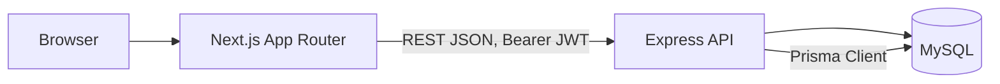

# Dhaka Tesla Pool

## Summary

A ride-pooling MVP built for the RoBenDevs Software Engineer assessment. Passengers request rides
between predefined Dhaka zones; compatible requests are pooled into a single Tesla trip so riders
share a car (and split part of the cost) while still tracking their own fare and status
individually. **Current state: backend feature-complete through Phase 6, all verified against a
real MySQL/MariaDB instance. Passenger frontend (Phase 7) implemented and verified live in a real
browser. Driver frontend (Phase 8) not started yet.**

## Problem Statement

Nusrat needs a ride from Banani to Mohakhali. Around the same time, Rafiq needs a ride from Banani
to Gulshan 1 — a nearby destination in the same corridor. Jashim drives Bullet, a Tesla with 3
seats, and could easily take them both on one trip instead of two separate ones. The product
problem isn't just "match nearby requests" — it's making sure each passenger still gets an
individual, fair fare (with a pooling discount when they actually share), a status they can
track through the whole trip, and a driver who sees one clear manifest for the car, not two
disconnected jobs. Getting the pooling *discount* right without letting two passengers' fares or
statuses bleed into each other is the actual engineering problem this MVP solves.

## Features Implemented

> Filled in phase by phase per `MASTER_PLAN.md` Section 8; kept accurate in `docs/PROGRESS.md`.
> The passenger flow now has a real UI (verified live in a browser); the driver flow is still
> backend-only (API calls) until Phase 8. Items below have been verified end-to-end against a real
> MySQL/MariaDB instance (see `docs/PROGRESS.md`), not just mocked tests.

**Passenger**
- [x] Signup / login (`POST /api/auth/signup`, `POST /api/auth/login`)
- [x] Request a ride (`POST /api/rides`) — pickup/destination/seats, immediate
  `estimated_fare_paisa`, automatically attempts pool matching
- [x] Track ride status (`GET /api/rides/:id`) — reflects `MATCHED` + finalized `farePaisa` once a
  driver accepts the pool
- [x] Ride history (`GET /api/rides`)
- [x] Cancel a ride (`POST /api/rides/:id/cancel`, from `REQUESTED`/`MATCHED` only) — releases the
  pool seat and cancels an emptied pool, verified live

**Driver**
- [x] Signup / login, register Tesla (`POST /api/teslas`, driver-only, rejects a second Tesla)
- [x] Online / offline toggle (`PATCH /api/teslas/:id/status`)
- [x] View pending pools/requests (`GET /api/driver/requests`)
- [x] Accept a pool (`POST /api/driver/pools/:poolId/accept`)
- [x] Advance pool through `DRIVER_ARRIVED` / `STARTED` / `COMPLETED`
  (`PATCH /api/driver/pools/:poolId/status`) — full lifecycle verified live for a pooled pair
- [x] Trip history (`GET /api/driver/history`), single-pool detail (`GET /api/driver/pools/:id`)

**Pooling**
- [x] Deterministic zone-cluster matching (no map API) — verified live with the exact Nusrat/Rafiq
  scenario
- [x] Capacity-safe concurrent seat claiming (`SELECT ... FOR UPDATE`) — proven with a real-database
  concurrency test (`npm run test:integration`), not just mocks
- [x] Fare finalization on pool `MATCHED` — exact integer match to the Section 5.2 worked example
  (৳70.50 / ৳85.50), verified live

## Screenshots / GIFs

Not yet captured as static images — the passenger flow (signup/login, request a ride, track
status, cancel, ride history) has been verified live in a browser (`docs/PROGRESS.md` Phase 7);
screenshots/GIFs will be added during the documentation pass before submission (Phase 10).

## Architecture

See [`docs/architecture.md`](./docs/architecture.md) for the full write-up.



Three layers: Next.js (presentation) → Express (routes/controllers/**services**, business logic
lives only in the service layer) → MySQL via Prisma (persistence).

## Database Design (ERD)

See [`docs/erd.md`](./docs/erd.md) for the full diagram and domain-model notes (matching vs.
driver acceptance, pool vs. ride-request state, the `seats_occupied` aggregate-counter rule, and
the one-active-pool-per-Tesla invariant).

`RideRequest.status` and `Pool.status` are two separate state machines and are never conflated —
grouping a request into a pool (`pool_membership` created) is not the same event as a driver
accepting that pool. `pool_memberships` is the sole relationship between `pools` and
`ride_requests`; `ride_requests` intentionally has no `pool_id` column.

## Tech Stack & Justification

| Layer | Choice | Why | Alternative considered | Would switch if... |
|---|---|---|---|---|
| Backend | Express | Minimal boilerplate, fast to reason about for a small MVP, team already fluent in it | NestJS (more structure but steeper setup cost for this scope) | Team/codebase grows past ~15 endpoints and needs enforced module boundaries |
| DB | MySQL (InnoDB) | Relational integrity + real FK constraints; InnoDB gives transactions and row-level locking (`SELECT ... FOR UPDATE`) needed for seat-capacity concurrency; widest free-tier hosting availability (PlanetScale, Railway, Aiven) | PostgreSQL (slightly stronger isolation defaults, native JSON/array types), SQLite (no real concurrency story) | Need heavy geospatial queries at scale, or stricter isolation guarantees → PostgreSQL + PostGIS |
| ORM | Prisma | Schema-first, migrations built-in, type-safe queries, works identically across MySQL/Postgres, fast to demo/explain | Knex (more manual), TypeORM (heavier) | N/A for this scope |
| Auth | JWT + bcrypt | Stateless, simple to reason about for an MVP with two roles | Session-based auth (needs sticky store) | Multi-device session revocation becomes a real requirement |
| Validation | Zod | Type inference + runtime validation in one place | Joi | N/A |
| Frontend | Next.js App Router | File-based routing, recommended by brief | Plain React + React Router | N/A |
| Styling | Tailwind CSS | Fast, matches existing experience | CSS Modules | N/A |
| Tests | Jest + Supertest (backend), Vitest/RTL (frontend, optional) | Standard, fast to set up | Mocha/Chai | N/A |
| Hosting | Frontend: Vercel. Backend + DB: whichever free-tier MySQL-compatible host is actually available at deploy time | Free, supports Docker + MySQL | Render (backend only; its free managed DB is Postgres-only) | Availability re-verified immediately before deployment, never assumed — see `docs/decisions.md` item 6 |

**Auth details:** JWT payload is minimal — `{ sub, role }`, no PII. Token is carried as
`Authorization: Bearer <token>`, held in a React context and persisted to `localStorage`
(trade-off: readable by any script on the page — accepted for this MVP, see
[`docs/decisions.md`](./docs/decisions.md) item 4). Auth-aware Next.js pages are client
components; SSR-authenticated pages are not implemented or claimed.

## Project Structure

```
backend/
  prisma/          schema, migrations, seed
  src/
    routes/        thin Express routers
    controllers/    req/res only, no business logic
    services/       business logic (matching, fare, lifecycle, cancellation)
    lib/            prisma client, jwt, fare math, state machine, errors
    validators/      Zod schemas
    data/           zones + distance table
  tests/           unit (mocked Prisma) + tests/integration (real DB)
frontend/
  app/              Next.js App Router pages (signup, login, rides/*)
  components/       NavBar, RequireAuth, StatusBadge
  lib/              api client, AuthContext, format helpers
```

## Prerequisites

- Node.js (tested with v24; anything reasonably current LTS should work — no Node-version-specific
  features used beyond standard ES2020+)
- npm
- A MySQL-compatible database (MySQL 8 or MariaDB — this repo has been verified against MariaDB
  10.4 via XAMPP, see `docs/decisions.md` item 13)
- Docker + Docker Compose (optional for now — full container setup lands in Phase 9)

## Environment Variables

Not yet defined — `.env.example` lands in Phase 1 and is finalized in Phase 9
(`feature/docker-deploy`). No real secrets will ever be committed.

## Local Setup (without Docker)

**Backend:**

```bash
cd backend
npm install
cp .env.example .env   # then point DATABASE_URL at a reachable MySQL 8 (or MariaDB) instance
npx prisma migrate deploy
npx prisma db seed
npm run dev             # http://localhost:4000
```

**Frontend** (passenger flow only — driver UI is Phase 8):

```bash
cd frontend
npm install
cp .env.example .env.local   # NEXT_PUBLIC_API_URL, defaults to http://localhost:4000
npm run dev              # http://localhost:3000 (or the next free port)
```

**Verified end-to-end** against a real local MySQL/MariaDB (XAMPP) instance — migration applied,
seed data confirmed, auth/Tesla/ride-request/pooling/lifecycle endpoints exercised live, and the
passenger frontend exercised in a real browser against the real running backend. See
`docs/PROGRESS.md` for the full verification log per phase, and `docs/decisions.md` item 13 for a
note that the verified local instance is MariaDB, not MySQL proper.

## Docker Setup

Not yet available — lands in Phase 9 (`feature/docker-deploy`). A backend + MySQL
`docker-compose.yml` skeleton exists (Phase 1) but has no automatic migration/seed step yet.

## Running Tests

```bash
cd backend
npm test                  # unit tests — mocked Prisma, no DB required
npm run test:integration  # real-database concurrency test — requires DATABASE_URL
```

57 unit tests currently pass (`health`, `auth`, `tesla`, `fare`, `ride`, `pool`, `poolAccept`,
`poolStatus`, `cancel` suites) — `fare`/`poolAccept` assert exact integer-paisa values against the
master plan's worked example (no floating-point comparisons, including the Nusrat/Rafiq
৳70.50/৳85.50 pooled fares); the rest use a **mocked** Prisma client (no live DB required) covering
validation, hashing, JWT issuance, role/ownership guards, matching logic, state-machine transition
guards, and HTTP status mapping.

`npm run test:integration` runs a separate, real-database concurrency test
(`tests/integration/concurrency.test.js`) that races two concurrent seat claims for the last seat
on a Tesla and asserts exactly one wins and `seats_occupied` never exceeds capacity — proving the
`SELECT ... FOR UPDATE` row lock actually works, which a mocked client can't simulate. Confirmed
deterministic across 5 consecutive runs against a live MySQL/MariaDB instance.

Endpoint behavior has separately been verified live against a real database, including the full
Nusrat+Rafiq pooling scenario (see `docs/PROGRESS.md` Phase 4). Required coverage overall is
tracked in `MASTER_PLAN.md` Section 9.

## Demo Credentials

Seeded by `backend/prisma/seed.js`, confirmed against a real database (see Local Setup above). All
accounts use the password `password123`.

| Role | Name | Email |
|---|---|---|
| Driver (owns Bullet, capacity 3) | Jashim | `jashim@dhakateslapool.test` |
| Passenger | Nusrat | `nusrat@dhakateslapool.test` |
| Passenger | Rafiq | `rafiq@dhakateslapool.test` |
| Passenger | Shirin | `shirin@dhakateslapool.test` |

## Fare Model

See [`docs/fare-model.md`](./docs/fare-model.md) for the full formula and worked example
(Nusrat/Rafiq pooled fares of ৳70.50 and ৳85.50, integer-paisa arithmetic only).

## Matching Rule

Deterministic, no map API. Two ride requests are pool-compatible if all of the following hold:

1. `pickup_zone.cluster` is identical for both requests
2. `destination_zone.cluster` is identical for both requests
3. `existing_pool.seats_occupied + new_request.seats_requested <= tesla.capacity`

Full rule and the Nusrat/Rafiq worked example: `MASTER_PLAN.md` Section 4.

## Concurrency Handling

MySQL (InnoDB) row lock inside a Prisma interactive transaction (`tx.$queryRaw` for
`SELECT ... FOR UPDATE`, since Prisma's query builder doesn't expose `FOR UPDATE` directly) is
sufficient and simple to reason about at MVP scale — InnoDB's default `REPEATABLE READ` isolation
combined with `FOR UPDATE` prevents a double seat-claim. At larger scale this would move to a
Redis-backed distributed lock or a single-writer queue per Tesla to avoid DB contention under high
concurrency (see `docs/scaling.md`, bonus, not yet written). Full pattern: `MASTER_PLAN.md`
Section 6; cancellation/seat-release flow: Section 6.1.

## Deployment

Not yet deployed — Phase 10/11.

## API Overview

Full contract in `MASTER_PLAN.md` Section 7. Implemented so far:

| Method | Path | Role | Status |
|---|---|---|---|
| POST | `/api/auth/signup` | public | ✅ implemented |
| POST | `/api/auth/login` | public | ✅ implemented |
| POST | `/api/teslas` | driver | ✅ implemented (rejects a 2nd Tesla per driver) |
| PATCH | `/api/teslas/:id/status` | driver (own) | ✅ implemented |
| POST | `/api/rides` | passenger | ✅ implemented |
| GET | `/api/rides/:id` | passenger (own) | ✅ implemented |
| GET | `/api/rides` | passenger | ✅ implemented |
| GET | `/api/zones` | public | ✅ implemented (not in master plan's table — added for pickup/destination dropdowns, `docs/decisions.md` item 14) |
| POST | `/api/rides/:id/cancel` | passenger (own) | ✅ implemented |
| GET | `/api/driver/requests` | driver | ✅ implemented |
| POST | `/api/driver/pools/:poolId/accept` | driver (own) | ✅ implemented |
| PATCH | `/api/driver/pools/:poolId/status` | driver (own) | ✅ implemented |
| GET | `/api/driver/pools/:id` | driver (own) | ✅ implemented |
| GET | `/api/driver/history` | driver | ✅ implemented |

## Key Decisions & Trade-offs

See [`docs/decisions.md`](./docs/decisions.md) for the running, dated log. Highlights so far:

- Row-lock (`SELECT ... FOR UPDATE`) chosen over a distributed lock for MVP simplicity — see
  Concurrency Handling above.
- Zone clusters are a flat, hardcoded grouping instead of real geo/distance — accuracy vs. build
  time trade-off, explicit and testable.
- Fare is finalized once, at pool `MATCHED`, not recalculated on later membership changes or
  cancellations — a deliberate simplification, documented as a known limitation below.
- One-active-pool-per-Tesla invariant and new-pool Tesla-selection policy — a gap in the original
  plan, resolved and logged with rationale in `docs/decisions.md` item 7.

## Known Limitations

- No real payment gateway.
- No real geo/routing — zone-to-zone distance is a hardcoded lookup table.
- `fare_paisa` is not retroactively recalculated for remaining pool members if another member
  cancels after `MATCHED`.
- JWT in `localStorage` (XSS-readable) instead of an `httpOnly` cookie — accepted MVP trade-off.
- Single-region deploy, no read replicas, no distributed lock — see `docs/scaling.md` (bonus) for
  the reasoning-only scale-out path.

## Next Improvements

- Move seat-capacity locking to a Redis-backed distributed lock or per-Tesla queue at higher
  concurrency.
- Replace zone-cluster matching with real geospatial distance (MySQL spatial types or
  PostgreSQL + PostGIS).
- `httpOnly` cookie-based auth with a same-site proxy for true SSR-authenticated pages.
- Recalculate remaining members' fares on mid-trip cancellation (currently a documented known
  limitation, not implemented).

## AI Usage

**Tools used:** Claude Code

**What for:** Phase 0 project analysis (cross-checking `MASTER_PLAN.md` for internal
contradictions before any code was written) and drafting `docs/architecture.md`, `docs/erd.md`,
`docs/fare-model.md`, `docs/decisions.md`, and this README's Phase-0-relevant sections.

**One accepted suggestion:** Flagging that `MASTER_PLAN.md` never specified how a new `OPEN` pool
picks its Tesla, or whether a Tesla can run more than one active pool at once — a real gap since a
driver can only physically run one trip at a time. Confirmed and adopted the "one active pool per
Tesla" invariant with an online-Tesla selection policy, logged in `docs/decisions.md` item 7.

**One rejected/changed suggestion:** _To be filled in as implementation proceeds — no code has
been written yet, so no implementation-level suggestions have been accepted or rejected._

## Demo Video

Not yet recorded — Phase 11.
