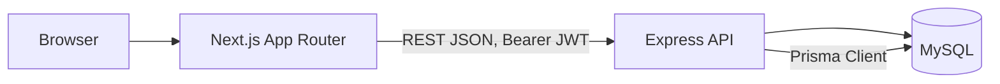

# Architecture

> Source of truth: `MASTER_PLAN.md` Section 2. This file exists so the diagram renders directly in
> tooling/README embeds without cross-referencing the master plan.

## Layer Diagram

## Layers

- **Presentation — Next.js (App Router).** Passenger flow, driver flow, and shared components.
  Auth-aware pages are client components (`"use client"`) because the JWT lives in `localStorage`,
  not an `httpOnly` cookie — see [decisions.md](./decisions.md) item 4. No SSR-authenticated pages
  are implemented or claimed in this MVP.
- **API — Express.** Routes → controllers → **services** → Prisma repository calls. Routes and
  controllers stay thin (request parsing, response shaping, Zod validation). All business logic —
  matching, fare calculation, state-machine transitions, capacity enforcement — lives in the
  service layer. This placement is explicitly scored in the brief, so it's a hard rule, not a
  style preference.
- **Persistence — MySQL via Prisma.** InnoDB engine (required for row-level locking via
  `SELECT ... FOR UPDATE`, used in the concurrency-sensitive paths — see
  [erd.md](./erd.md) and the master plan Section 6). Migrations are checked into the repo under
  `backend/prisma/migrations`.

## Why this shape (not microservices, not a queue)

Two services (Express API, Next.js frontend) talking to one MySQL instance is the entire system.
No message broker, cache, or second datastore is introduced — Section 0 and Section 11 of the
master plan explicitly rule these out for the MVP. Scaling paths that *would* introduce them
(Redis-backed distributed lock, event queue for matching, read replicas) are reasoning-only, in
`docs/scaling.md` (bonus), never implemented here.

## Request flow example — claiming a seat

1. Browser submits a ride request via a Next.js client component, `Authorization: Bearer <jwt>`.
2. Express route validates the JWT (middleware) and the request body (Zod), then hands off to
   the ride-request service.
3. The service opens a Prisma interactive transaction, takes a row lock on the target pool
   (`tx.$queryRaw ... FOR UPDATE`), checks capacity, and either creates the `pool_membership` and
   increments `seats_occupied`, or throws and rolls back (→ 409).
4. Prisma commits; the API returns the ride request's current state (still `REQUESTED` — see
   [erd.md](./erd.md) Section "Matching vs. Driver Acceptance").

## Status

Phase 0 (documentation) only. No backend/frontend code exists yet — see `docs/PROGRESS.md`.
