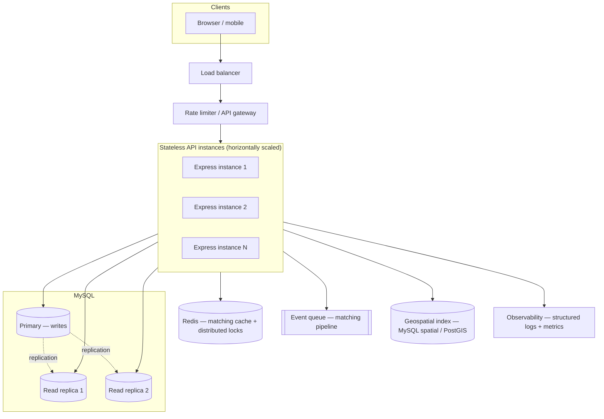

# Scaling — "If Oi Tesla Goes Viral" (bonus, reasoning only)

> Per `MASTER_PLAN.md` Section 10 / the brief's Section 12: this is a reasoning exercise, not a
> build target. None of what follows is implemented — the MVP intentionally stays on a single
> Express process, one MySQL instance, and in-process locking (`SELECT ... FOR UPDATE`), per the
> MVP Restrictions in `CLAUDE.md` (no Kafka/Redis/Kubernetes/queues in the actual codebase).

## Scenario

Dhaka Tesla Pool goes viral: ~1,000,000 passengers, ~100,000 drivers, city-wide. The MVP's design
choices — a single Express instance, one MySQL primary, row-locking via `FOR UPDATE`, zone-cluster
matching — were all correct for the assessed scope, but each becomes a bottleneck at this scale.
Below is what would change, and why, one MVP decision at a time.

## What changes, and why

**Load balancer + multiple stateless API instances.** The MVP's JWT-based auth (Section 1.1) is
already stateless — no server-side session store — so horizontal scaling here is close to free:
any instance can serve any request. A load balancer (e.g. an ALB, or nginx) distributes traffic
across N Express instances behind it.

**MySQL primary + read replicas.** Ride history reads (`GET /api/rides`, `GET /api/driver/history`)
vastly outnumber writes at this scale and don't need the strictest consistency — route them to read
replicas, keep writes (ride creation, seat claims, status transitions) on the primary. This is a
pure read/write split at the connection-routing layer; no schema change.

**Redis for pool-matching cache + distributed lock, replacing in-process `FOR UPDATE`.** The MVP's
`SELECT ... FOR UPDATE` (Section 6) is correct and sufficient for one MySQL instance, but it
becomes a contention point once there are many API instances hammering the same hot pool rows
concurrently (e.g. a popular route at rush hour). A Redis-backed distributed lock (or a
per-Tesla single-writer queue) moves that contention out of the database's row-lock manager into a
purpose-built, much faster in-memory store, and a Redis cache of "currently `OPEN` pools per
cluster" avoids a full-table matching scan per request.

**Geospatial search, replacing the flat zone-cluster table.** The MVP's `zones.cluster` column
(Section 4, `docs/decisions.md` item 5) is a deliberate simplification — a flat grouping, not real
distance. At city scale this stops being defensible: real lat/long + `ST_Distance_Sphere` (MySQL
8's native spatial functions) or a move to PostgreSQL + PostGIS (if query complexity grows past
what MySQL's spatial types comfortably express) would replace it, enabling proximity-based
matching instead of a fixed cluster label.

**Event queue (SQS/BullMQ) decoupling the matching pipeline.** Currently, matching runs
synchronously inside `POST /api/rides` (Phase 4/5, `docs/decisions.md` item 17). At high request
volume, a new ride request would instead publish an event; a pool of matching workers consumes the
queue asynchronously, decoupling "accept the request" (fast, always succeeds) from "find or create
a compatible pool" (can take longer, can retry on transient failure without blocking the
passenger's HTTP response).

**Rate limiting at the gateway, not just `/api/auth/*`.** The MVP's `express-rate-limit`
(Section 13.5) only guards login/signup, appropriate for demo-scale brute-force protection. At
scale, rate limiting moves to the API gateway/load-balancer layer, applied per-passenger and
per-driver, protecting the matching and seat-claim endpoints from abuse too.

**Idempotency keys, already built, become load-bearing rather than a nice-to-have.** The MVP's
`Idempotency-Key` support (Section 13.1, `docs/decisions.md` item 20) already exists for exactly
this reason: retries under real network conditions (mobile data drops, client timeouts) become far
more common at scale, and the existing unique-constraint-based dedup keeps working unchanged — no
redesign needed here, just more traffic exercising a path that's already correct.

**Observability — structured logs + basic metrics.** The MVP's request-correlation middleware
(Section 13.4, `requestId` on every log line) is the seed of this. At scale it feeds a real
metrics/tracing pipeline (e.g. Prometheus + Grafana, or a hosted APM) so a driver-assignment
failure or a fare-calculation error can be traced across the distributed matching pipeline.

**Retry/backoff on driver-assignment failures.** With matching moved to an async queue, a failed
match (e.g. no eligible online Tesla in a cluster at that instant) needs an explicit retry/backoff
policy — re-attempt on a schedule, or when a new Tesla comes online in that cluster — rather than
the MVP's simpler "stays unpooled until the next `POST /api/rides` matching pass" behavior
(`docs/decisions.md` item 17).

## What does *not* change

The core domain model — two separate state machines (`RideRequest.status` / `Pool.status`),
`pool_memberships` as the sole pool↔ride-request relationship, fare finalized once at `MATCHED`,
integer-paisa money — holds at any scale. None of these are scale-driven simplifications; they're
correctness decisions that stay correct regardless of traffic volume. Scaling changes
*infrastructure*, not the domain model documented in `docs/erd.md`.
